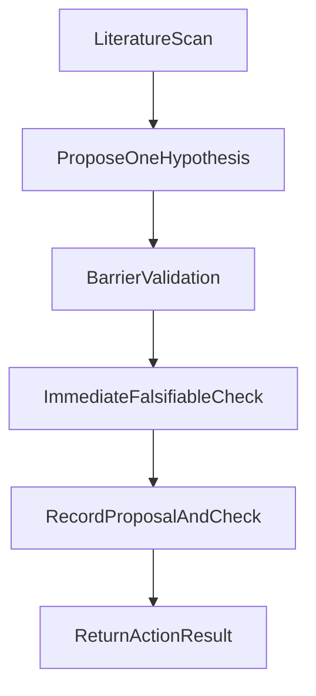

# NEW MATH

## Purpose

Propose one novel P vs NP direction that targets barrier evasion, then run one immediate
falsifiable check before ending the session.

## Cycle Contract

- One hypothesis.
- One immediate falsifiable check.
- One logged proposal record.
- Return one standardized action result.



## Step 0: Resume and Literature

Read:

- `search/logs/new_math_proposals.jsonl` (last line if present)
- `memory_bank/mmemory_bank_activeContext.md`

Run targeted literature scan (WebSearch) for recency and known refutations.

## Step 1: Propose One Hypothesis

Generate exactly one hypothesis, not three.

Output:

```json
{
  "hypothesis_name": "<name>",
  "core_claim": "<single falsifiable claim>",
  "first_formal_target": "<lean_or_proof_target>",
  "expected_barrier_profile": {
    "relativization": "evades|blocked|unclear",
    "natural_proofs": "evades|blocked|unclear",
    "algebraization": "evades|blocked|unclear"
  }
}
```

## Step 2: Barrier Validation

Validate against the three barriers and recent known objections.
If clearly blocked by literature, mark `status=blocked` and still provide one revised check target.

## Step 3: Immediate Falsifiable Check (Mandatory)

Run one concrete check in the same session, chosen by cheapest path:

- SAT check on reduced instance.
- Lean sanity theorem/proof skeleton check.
- Proof complexity counterexample probe.

Record:

```json
{
  "check_type": "sat_probe|lean_probe|counterexample_probe",
  "check_target": "<statement_or_instance>",
  "check_result": "supports|refutes|inconclusive|failed",
  "evidence_refs": ["<paths_hashes_logs>"]
}
```

## Step 4: Record

Append one line to `search/logs/new_math_proposals.jsonl`:

```json
{
  "timestamp": "<unix>",
  "chosen_approach": "<hypothesis_name>",
  "core_claim": "<claim>",
  "barrier_profile": {
    "relativization": "evades|blocked|unclear",
    "natural_proofs": "evades|blocked|unclear",
    "algebraization": "evades|blocked|unclear"
  },
  "immediate_check": {
    "type": "<type>",
    "result": "<result>"
  },
  "next_recommended_action": "prove_step|mine_step|new_math_step"
}
```

## Step 5: Return to Saturday

Return exactly:

```json
{
  "status": "success|partial|blocked",
  "artifact_refs": ["<files_hashes_logs>"],
  "barrier_assessment": {
    "relativization": "blocked|evades|unclear",
    "natural_proofs": "blocked|evades|unclear",
    "algebraization": "blocked|evades|unclear"
  },
  "next_recommended_action": "prove_step|mine_step|new_math_step"
}
```

Mapping:

- Check `supports` with no known hard barrier contradiction -> `success`
- Check `inconclusive` -> `partial`
- Check `refutes` or clear barrier block -> `blocked`

## Invariants

- Never end a new-math session without an immediate falsifiable check.
- Keep work local and reproducible.
- One active hypothesis thread at a time.
---
name: new-math
description: >
  Proposes new mathematical approaches to P vs NP, debates them with the user,
  then pursues the chosen approach. Use when the current chain is barrier-blocked,
  or when the user says "new math", "new direction", or "what next for P vs NP".
---

# NEW-MATH

**Resume rule:** check `search/logs/new_math_proposals.jsonl` at session start. If an
approach is active, read `research/<slug>/README.md` and resume at the recorded step.

**Three barriers** (all proofs are tested against these):
- Relativization (BGS 1975): proof must behave differently with vs without a PSPACE oracle
- Natural proofs (RR 1997): hardness property must not be poly-time checkable on random functions
- Algebraization (AW 2008): proof must not extend to algebrized oracle models

---

## Step 0: Literature Search

Run four WebSearches. Summarize into `{LITERATURE_CONTEXT}` (recent directions, refuted
directions, notable unverified claims). Pass to Step 1.

```
"P vs NP barrier evading proof techniques 2025 2026"
"non-relativizing non-naturalizing circuit complexity lower bound recent"
"geometric complexity theory Mulmuley progress 2024 2025"
"proof complexity circuit lower bound separation 2024 2025"
```

---

## Step 1: Proposer (subagent)

Build `{PRIOR_APPROACHES}` from all `chosen_approach` values in `new_math_proposals.jsonl`.

Subagent prompt:
```
You are a research mathematician proposing approaches to separate P from NP.

Do not re-propose: {PRIOR_APPROACHES}
Do not propose: diagonalization, monotone lower bounds, time hierarchy, GCT, lifting,
MCSP amplification, or extensions of any existing program.

Literature: {LITERATURE_CONTEXT}

Propose exactly 3 genuinely novel approaches. For each:
1. Name and one plain-English sentence.
2. The fundamental insight it exploits.
3. Which barriers it evades and why (one sentence each). Which it does NOT evade.
4. The single first Lean 4 theorem to prove.
5. Estimated difficulty: months / years / decade.
6. Why no one has seriously tried this before.

Two layers per proposal: PLAIN ENGLISH (2-3 sentences) then TECHNICAL DETAIL.
Argue for your proposals. Concede only to valid mathematical objections.
No JSON. No hyphens. No emojis.
```

---

## Step 2: Debate (HITL)

Print proposals. For each user reply that is not "go with X", spawn a new Proposer
subagent with conversation history and print its response. Repeat until "go with X".

---

## Step 3: Commit

```bash
WORKSPACE=$(git rev-parse --show-toplevel)
SLUG="<slug>"
BASE="$WORKSPACE/research/$SLUG"
mkdir -p "$BASE/lean" "$BASE/sat" "$BASE/logs" "$BASE/notes"
```

Write `$BASE/README.md` with: one-line description, barrier evasion verdicts, first
Lean target, known blockers, status. Write `$BASE/notes/literature.md` with Step 0
results (leave Step 5 and Step 6 sections blank for later).

```bash
python3 -c "
import json, time
print(json.dumps({'timestamp': int(time.time()), 'chosen_approach': '<name>',
  'slug': '$SLUG', 'barrier_evasion_claimed': '<summary>',
  'first_lean_target': '<target>'}))
" >> "$WORKSPACE/search/logs/new_math_proposals.jsonl"
```

Route to proof-sprint (Lean target) or ORACLE (needs SAT evidence) or write an
empirical Python script in `research/<slug>/` first if the conjecture is unverified.

---

## Step 4: Pursue

Follow the routed skill. Before any Lean formalization, run the cheapest empirical
check (Python, test on 2-SAT first). Log to `research/<slug>/logs/`. Update
`research/<slug>/README.md` after each session. Lean files go in `research/<slug>/lean/`.

---

## Step 5: Barrier Validator (subagent)

Search: `"<approach> barrier relativization natural proof"` and
`"<approach> P vs NP refutation 2024 2025 2026"`. If a published refutation is found,
return BARRIER_BLOCKED immediately with citation.

Otherwise spawn subagent:
```
Theorem: <name and statement>
Technique: <summary>
Barrier evasion claimed: <from README>
Literature: {VALIDATION_LITERATURE}

For each barrier: verdict (blocked / evades / unclear) + one sentence.
Overall: BARRIER_CLEAR or BARRIER_BLOCKED.
If BARRIER_BLOCKED: name it and suggest a fix.
Two layers: PLAIN ENGLISH then TECHNICAL DETAIL.
```

BARRIER_BLOCKED -> return to Step 2. BARRIER_CLEAR -> Step 6.

---

## Step 6: Victory Check

Search `"<theorem> OR <approach> P vs NP proof 2025 2026"`. Append any flaws found
to the HITL prompt.

```bash
WORKSPACE=$(git rev-parse --show-toplevel)
LEAN_DIR="$WORKSPACE/research/<slug>/lean"
SORRY_COUNT=$(grep -rn ":= sorry\|^ *sorry$" --include="*.lean" "$LEAN_DIR" 2>/dev/null | wc -l | tr -d ' ')
cd "$WORKSPACE/theory" && lake build 2>/dev/null
lake env lean --stdin <<'LEAN' 2>&1 | grep -q "sorryAx" && echo "SORRY_AX" || echo "CLEAN"
#print axioms <theorem_name>
LEAN
```

If SORRY_COUNT=0 and CLEAN, print HITL prompt and wait for user YES. On YES:

```bash
WORKSPACE=$(git rev-parse --show-toplevel)
cd "$WORKSPACE"
git add -f research/<slug>/ search/logs/
git commit -m "P != NP proved: <theorem name>"
```

Not YES -> return to Step 4.

---

## Conventions

- N1: User has final say. Subagent argues but does not override.
- N2: Barrier verdicts mandatory from both Proposer and Validator.
- N3: Human confirms victory. No automated P != NP commit.
- N4: One approach at a time. Finish or abandon before starting another.
- N5: All approach files in `research/<slug>/`. Never in `theory/` or `proofs/`.
- N6: Literature search at Steps 0, 5, and 6. Save summaries to `notes/literature.md`.
