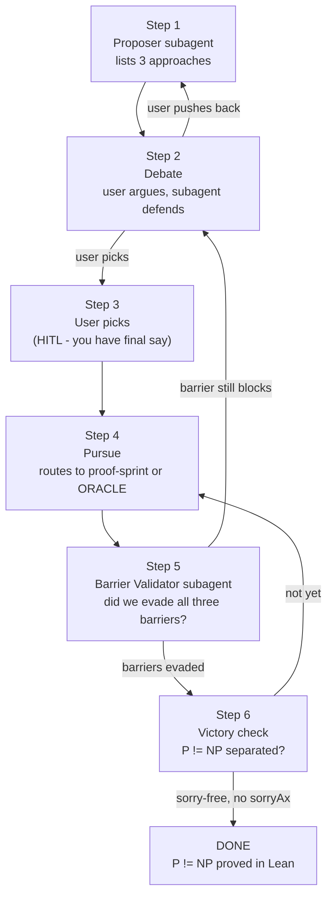

# NEW-MATH: Mathematical Strategy and Pursuit

## Purpose

Identify a mathematical approach to P vs NP that plausibly evades all three
known barriers, agree on it with the user, then pursue it using the existing
proof and mining infrastructure.

## The Loop



---

## Step 1: Proposer (spawn subagent)

Spawn one subagent. It proposes exactly 3 approaches. Each must state explicitly
which of the three barriers it evades and how. No hedging.

**The three barriers (pass verbatim to the subagent):**
- Relativization (BGS 1975): proof must behave differently with vs without a PSPACE oracle
- Natural proofs (Razborov-Rudich 1997): proof must not be polynomial-time checkable on random functions
- Algebraization (AW 2008): proof must not extend to algebrized oracle models

**Subagent prompt:**
```
You are a research mathematician proposing approaches to separate P from NP.

The current approach (Razborov monotone lower bounds) is blocked by all three
barriers: relativization, natural proofs, and algebraization.

Propose exactly 3 distinct approaches. For each:
1. Name and one-sentence description (no hyphens).
2. Which barriers it evades and the mechanism (one sentence each).
3. Which barriers it does NOT evade and why (be honest).
4. The single first theorem to prove in Lean 4 if this approach were pursued.
5. Estimated difficulty: months, years, or decade.

Be concrete. Cite a named paper, author, or research program for each.
Do not propose: diagonalization, monotone lower bounds, time hierarchy variations.

You will argue for these proposals against the user. Do not immediately concede
if pushed back on. Defend your reasoning, but update if the user raises a valid
technical point.

Return a markdown list. No JSON. No hyphens. Be direct.
```

---

## Step 2: Debate (HITL loop — no subagent)

Print the Proposer output to the user, then enter a discussion loop.

**Print verbatim:**
```
------------------------------------------------------------
MATHEMATICAL APPROACH PROPOSALS
------------------------------------------------------------
<Proposer output here>

------------------------------------------------------------
Your turn. Push back, ask questions, or propose your own direction.
When you are ready to commit to one approach, say: "go with <name>"
------------------------------------------------------------
```

For each user message that is not "go with X":
- Spawn a new Proposer subagent with the conversation history
- Let it defend or revise the proposals
- Print its response
- Repeat

The subagent should argue. It should not capitulate to social pressure. It should
concede only to valid mathematical arguments (e.g., "that approach relativizes
because..."). If the user proposes something new, evaluate it by the same barrier
criteria and say whether it qualifies.

When the user says "go with <name>", proceed to Step 3.

---

## Step 3: Commit (orchestrator — no subagent)

Record the chosen approach:
```bash
python3 -c "
import json, time
entry = {
  'timestamp': int(time.time()),
  'chosen_approach': '<name from user>',
  'barrier_evasion_claimed': '<from debate summary>',
  'first_lean_target': '<from Proposer output>'
}
print(json.dumps(entry))
" >> /Users/nmm/Development/SATurday/search/logs/new_math_proposals.jsonl
```

Print:
```
Approach locked: <name>
First Lean target: <target>
Routing to proof-sprint / ORACLE as appropriate.
```

Then route:
- If first target is a Lean theorem: hand off to `.cursor/skills/proof-sprint/SKILL.md`
  with the chosen approach's first_lean_target as the Navigator's context.
- If first target needs empirical SAT evidence first: hand off to `.cursor/skills/run-oracle/SKILL.md`.

---

## Step 4: Pursue

Follow whichever skill was routed to in Step 3. Return the outcome
(closed / published / stuck / timeout) when done.

---

## Step 5: Barrier Validator (spawn subagent)

After each closed result, spawn one subagent to confirm barrier evasion.

**Subagent prompt:**
```
You are a skeptical complexity theorist. A proof attempt has produced the
following result:

  Theorem: <theorem name and statement>
  Proof technique: <summary of approach>
  Barrier evasion claimed: <from Step 3 record>

Apply each barrier test:

Relativization: Does this proof work relative to a PSPACE oracle?
  If yes, it is relativizing and cannot separate P from NP.

Natural proofs: Is the hardness property used here polynomial-time checkable
  on random functions? Is it largeness-closed?
  If yes to both, it is a natural proof.

Algebraization: Does the argument extend to algebrized oracle models?
  If yes, it algebrizes.

For each barrier: verdict (blocked / evades / unclear) and one-sentence reason.
Overall verdict: BARRIER_CLEAR or BARRIER_BLOCKED.
If BARRIER_BLOCKED: name the blocking barrier and suggest how to modify the approach.
```

If verdict is BARRIER_BLOCKED: return to Step 2 with the blocking barrier as new
context for the debate.

If verdict is BARRIER_CLEAR: proceed to Step 6.

---

## Step 6: Victory Check (orchestrator — no subagent)

A result only counts as separating P from NP if ALL of the following hold:

```bash
# 1. The target theorem is sorry-free in Lean
SORRY_COUNT=$(cd /Users/nmm/Development/SATurday/theory && \
  grep -rn ":= sorry\|^ *sorry$" --include="*.lean" \
  <path to approach theorem file> 2>/dev/null | wc -l | tr -d ' ')

# 2. No sorryAx in the axiom set
cd /Users/nmm/Development/SATurday/theory && lake build 2>/dev/null
lake env lean --stdin <<'LEAN' 2>&1 | grep -q "sorryAx" && echo "SORRY_AX" || echo "CLEAN"
#print axioms <theorem_name>
LEAN

# 3. The theorem statement actually separates P from NP
# (must be verified by human - see HITL below)
```

If SORRY_COUNT=0 and output is CLEAN:

**Print HITL prompt and wait for human confirmation:**
```
============================================================
POTENTIAL P != NP SEPARATION
============================================================
Theorem: <name>
Statement: <statement>
Barrier Validator verdict: BARRIER_CLEAR
No sorry. No sorryAx.

HUMAN VERIFICATION REQUIRED.
Does this theorem constitute a separation of P from NP?
Does the theorem statement correctly formalize P and NP?
Does the proof technique match what the Barrier Validator analyzed?

Enter YES to confirm, or describe what is missing:
```

If user enters YES:
```
============================================================
P != NP PROVED
============================================================
Theorem: <name>
Human confirmed: yes
Barrier clear: yes
Lean verified: yes

Commit and notify.
============================================================
```

```bash
cd /Users/nmm/Development/SATurday
git add -f theory/ search/logs/
git commit -m "P != NP proved: <theorem name>"
```

---

## Conventions

**N1 — User has final say on approach.** The subagent argues but does not override.

**N2 — Barrier verdicts are mandatory.** No approach proceeds without explicit
verdicts on all three barriers from the Proposer and the Validator.

**N3 — Human confirms victory.** No automated commit of a P vs NP result.
The loop always stops for human review before the final commit.

**N4 — One approach at a time.** Do not pursue multiple directions in parallel.
Finish or abandon the current approach before starting a new one.
