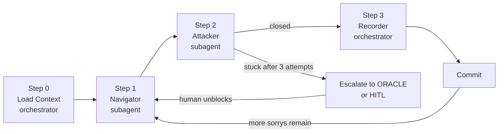

# PROOF SPRINT

## Goal

Move one node from `sorry` or `axiom` (with open obligation) to `theorem` (fully proved)
in the chain leading to `monotone_parity_exponential_lower_bound_v12`.

Every session closes at least one node. If zero nodes are closed, the session ends by
logging the blocker and handing off to the ORACLE skill.

## The Loop



---

## Step 0: Load Context (orchestrator — no subagent)

Read these files directly using the Read tool:

- `memory_bank/mmemory_bank_activeContext.md`
- `memory_bank/mmemory_bank_progress.md`
- `theory/Theory/Sunflower.lean`
- `theory/Theory/Circuits.lean`
- `theory/Conjectures/BetA/Proofs/MonotoneParityInductive.lean`

Run this sorry inventory via Shell:

```bash
cd /Users/nmm/Development/SATurday/theory && \
  grep -rn ":= sorry\|^ *sorry$" --include="*.lean" | grep -v "^Binary"
```

Construct a `SorryMap` (list of `{file, line, theorem_name}`) and pass it to the Navigator.

---

## Step 1: Navigator (spawn subagent)

```
Task tool call:
  subagent_type: generalPurpose
  description: "Proof Sprint Navigator"
  prompt: |
    You are the Navigator for a mathematical research sprint targeting P vs NP.

    First, read these files in full:
      memory_bank/mmemory_bank_activeContext.md
      theory/Theory/Sunflower.lean
      theory/Theory/Circuits.lean
      theory/Conjectures/BetA/Proofs/MonotoneParityInductive.lean
      .cursor/rules/lean4-development.mdc

    You are given this SorryMap:
      {SORRY_MAP_JSON}

    Your job: identify the single open sorry whose closure would most advance the proof
    of `monotone_parity_exponential_lower_bound_v12`, and which is feasible to close
    in one session (all dependencies are either proved or are named axioms).

    Selection rules:
    1. Prefer the sorry deepest in the dependency chain toward V12 that has no
       sorry-blocked dependencies. This is the "blue frontier" in blueprint terminology.
    2. Among ties, prefer the sorry with the smallest expected proof size.
    3. If the only available sorry requires a new axiom, flag it and recommend HITL.

    For the chosen sorry, read its containing file section carefully. Then answer:

    What are the relevant Mathlib lemmas? Search by reasoning about the types involved.
    Useful tactics to try first: `simp`, `exact?`, `apply?`, `omega`, `linarith`, `aesop`.

    Return ONLY a JSON block:
    {
      "chosen_sorry": {
        "theorem_name": "<name>",
        "file": "<path>",
        "line": <int>,
        "statement": "<Lean statement>",
        "context": "<brief description of what this needs to prove>"
      },
      "proof_approach": {
        "informal_sketch": "<2-5 sentence informal proof, no hyphens>",
        "lean_tactic_attempt": "<Lean tactic block to replace the sorry>",
        "mathlib_lemmas": ["<lemma1>", "<lemma2>"],
        "barrier_tag": "relativization_safe|natural_proof_safe|algebraization_safe|unknown",
        "barrier_justification": "<one sentence>"
      },
      "fallback_approach": "<if first attempt fails, try this instead>",
      "rationale": "<why this sorry, why now>"
    }
```

Collect the `NavigatorOutput` JSON before proceeding.

---

## Step 2: Attacker (spawn subagent)

```
Task tool call:
  subagent_type: generalPurpose
  description: "Proof Sprint Attacker"
  prompt: |
    You are the Attacker for a mathematical research sprint.

    First, read these files:
      {CHOSEN_SORRY_FILE}
      theory/Theory/Circuits.lean
      theory/Theory/EncodingCorrectness.lean
      .cursor/rules/lean4-development.mdc

    Your target:
      {NAVIGATOR_OUTPUT_JSON}

    Your job: close the chosen sorry. You have two tools:

    TOOL A — Lean tactics (for proof-theoretic sorrys):
      1. Write the tactic block from proof_approach.lean_tactic_attempt.
      2. Use Shell to replace the sorry:
           cd /Users/nmm/Development/SATurday/theory
           lake build <module_name> 2>&1 | tail -30
      3. If it fails, read the error and try the fallback_approach.
      4. Use `exact?`, `apply?`, `simp?`, `rw?` diagnostics to find missing lemmas:
           echo "example : <goal_type> := by exact?" > /tmp/probe.lean
           lean /tmp/probe.lean 2>&1 | head -20
      5. Repeat up to 3 attempts. Each attempt must change the tactic block.

    TOOL B — Kissat (for sorrys reducible to UNSAT):
      If the sorry asserts that no circuit of size <= k exists, encode it as CNF
      via CircuitSynthesisEncoder, run Kissat, get LRAT hash, and use
      lrat_implies_lower_bound to close the sorry. See run-oracle SKILL.md for
      the encoding pattern.

    After each build attempt, prepend the informal_sketch as a comment above the
    tactic block so the sketch is always in the file.

    If all 3 attempts fail: restore the original sorry, add a comment:
      -- BLOCKER: <what was tried, why it failed, what is needed>
    and return status "stuck".

    Return ONLY a JSON block:
    {
      "theorem_name": "<name>",
      "status": "closed|stuck",
      "attempts": <int>,
      "final_tactic": "<tactic block if closed, or null>",
      "blocker": "<description if stuck, or null>",
      "new_axioms_introduced": [],
      "barrier_tag": "<from Navigator>"
    }
```

Collect the `AttackerOutput` JSON.

---

## Step 3: Recorder (orchestrator — no subagent)

**If status = "closed":**

1. Run axiom check via Shell:
   ```bash
   cd /Users/nmm/Development/SATurday/theory
   echo "set_option pp.all false\n#print axioms <theorem_name>" >> /tmp/axiom_check.lean
   lean --run /tmp/axiom_check.lean 2>&1
   rm /tmp/axiom_check.lean
   ```
   Confirm no `sorryAx` appears. Confirm no new axioms beyond the baseline:
   `lrat_implies_lower_bound`, `synthesis_encoding_correct`, `lrat_checker_sound`,
   `sunflower_lemma`, `Classical.choice`, `propext`, `Quot.sound`, `funext`.

2. Append to `search/logs/proof_sprint_log.jsonl`:
   ```json
   {"session": <N>, "theorem_closed": "...", "file": "...", "attempts": <int>,
    "barrier_tag": "...", "timestamp": <unix>}
   ```

3. Commit:
   ```bash
   git add -f theory/ search/logs/proof_sprint_log.jsonl
   git commit -m "Close sorry: <theorem_name> (<barrier_tag>)"
   ```

4. Run victory check:
   ```bash
   V12_SORRYS=$(cd /Users/nmm/Development/SATurday/theory && \
     grep -rn ":= sorry\|^ *sorry$" \
       Conjectures/BetA/Proofs/MonotoneParityInductive.lean \
       Theory/Sunflower.lean \
       --include="*.lean" 2>/dev/null | wc -l | tr -d ' ')
   echo "V12_SORRYS=$V12_SORRYS"
   ```
   If `V12_SORRYS=0`, run the secondary sorryAx check:
   ```bash
   cd /Users/nmm/Development/SATurday/theory && lake build 2>/dev/null
   lake env lean --stdin <<'LEAN' 2>&1 | grep -q "sorryAx" && echo "SORRY_AX_FOUND" || echo "DONE"
   #print axioms monotone_parity_exponential_lower_bound_v12
   LEAN
   ```
   If output is `DONE`, print verbatim and stop all further work:
   ```
   ============================================================
   RESEARCH GOAL COMPLETE
   ============================================================
   Theorem: monotone_parity_exponential_lower_bound_v12
   Statement: For all n >= 2, any monotone circuit computing parity-n has size >= 2^(n/4).
   Status: Fully proved in Lean 4. No sorry. No sorryAx.
   Axiom baseline: lrat_implies_lower_bound, sunflower_lemma, synthesis_encoding_correct,
                   lrat_checker_sound, Classical.choice, propext, Quot.sound, funext
   Next step: Human review. Consider submitting to Lean community or arXiv.
   ============================================================
   ```

**If status = "stuck":**

Append to `search/logs/proof_sprint_log.jsonl`:
```json
{"session": <N>, "theorem_attempted": "...", "status": "stuck", "blocker": "...", "timestamp": <unix>}
```

Evaluate escalation:
- If the stuck sorry is encodable as a SAT problem: hand off to ORACLE skill.
- Otherwise: print HITL prompt below and wait for human input.

**HITL prompt (print verbatim when escalation is needed):**
```
PROOF SPRINT BLOCKED
Theorem: <theorem_name>
File: <file>:<line>
Blocker: <blocker description>
Attempts: <N>
Barrier tag: <tag>

Options:
  1. Provide a proof sketch or Mathlib lemma to try.
  2. Confirm this should be promoted to an axiom (requires justification).
  3. Skip this sorry and target a different node.
  4. Hand off to ORACLE for SAT encoding.
Enter choice (1-4):
```

---

## Conventions

These apply to every session. The Attacker must confirm C1 and C2 before committing.

**C1 — Barrier tagging.**
Every theorem closed must carry one of: `relativization_safe`, `natural_proof_safe`,
`algebraization_safe`. If `unknown`, do not commit without human checkpoint (HITL).
Justification: the three known barriers (Baker-Gill-Solovay 1975, Razborov-Rudich 1997,
Aaronson-Wigderson 2008) define what techniques can possibly separate P from NP. Every
proof step should be on the right side of at least one barrier.

**C2 — No silent axioms.**
Every `axiom` must be accompanied by a named proof obligation in
`theory/Theory/EncodingCorrectness.lean` or a direct analog. Pattern:
```lean
-- Proof obligation: <what needs to be proved to eliminate this axiom>
axiom my_claim : ...
```

**C3 — One node per session.**
If zero sorrys are closed after a full sprint: log the blocker, run the ORACLE skill
instead, and return to proof-sprint next session.

---

## Current Proof Chain (V12 target)

```
Proved (green, no sorry):
  lrat_implies_lower_bound        (axiom — named obligations in EncodingCorrectness.lean)
  monotone_parity_N_lower_bound   n=2..8 (all C.size > 32, LRAT certified)
  andGateSupportFamily            (noncomputable def, fully implemented)
  andGateFamilySizeLeCircuitSize  (lemma, fully proved)
  V12 n=2..8 branch               (closed via interval_cases + omega, session 2)

Blue frontier (attack these next):
  monotone_parity_sunflower_connection   (Theory/Sunflower.lean:196)
    needs: Razborov restriction argument or LRAT certs for n=9..16 to widen interval_cases

Open (blocked by frontier):
  V12 n>=9 branch                 (MonotoneParityInductive.lean)
  monotone_parity_exponential_lower_bound_v12  (fully proved once sunflower closes)

Axiom obligations (open):
  sunflower_lemma           (Erdos-Ko-Rado 1960 — proof is ~20 pages, long-term)
  synthesis_encoding_correct  (Python encoder faithfulness — needs formal audit)
  lrat_checker_sound          (LRAT verifier soundness — needs cake_lpr integration)
```

The shortest path to V12 now runs through `monotone_parity_sunflower_connection`
(Razborov argument) or through widening the LRAT base case coverage to n=9+.

---

## Escalation to ORACLE

If the chosen sorry is best closed via a SAT certificate (e.g., "no circuit of size k
computes parity-n"), switch to the ORACLE skill. The ORACLE skill handles:
- CNF encoding via CircuitSynthesisEncoder
- Kissat LRAT certificate generation
- Lean anchor via `lrat_implies_lower_bound`

Return to proof-sprint once the LRAT anchor is in place.
