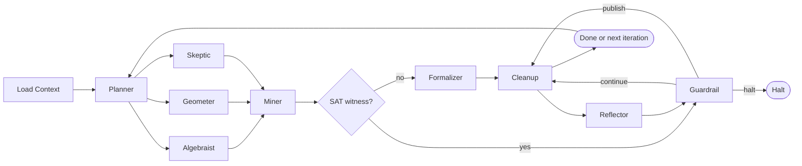
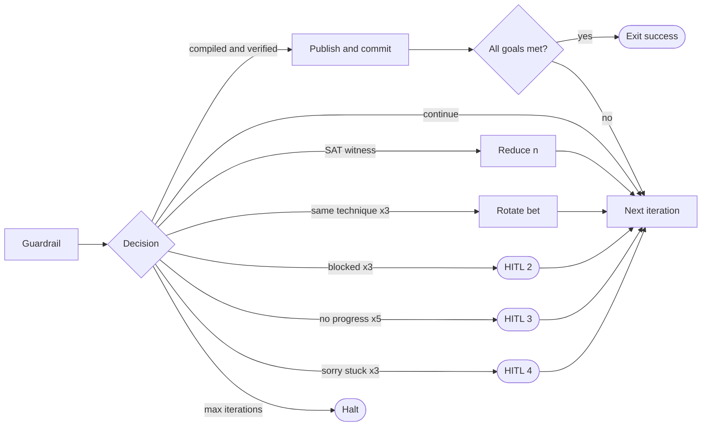

# ORACLE: Multi-Agent Mathematical Research Loop

Works for any formal math research project. Reads project context at startup.
Runs until a goal is reached, a HALT condition fires, or a human is needed.

Each step below that says "Spawn subagent" requires a REAL `Task` tool call — not
reading a rule in your own context. Subagents have isolated context. Pass all
necessary state explicitly in the prompt.

**Shell tool note**: Use the `Shell` tool directly (not a shell subagent) for all
file I/O, CNF generation, and Kissat invocations. The `shell` subagent type lacks
the Read tool and cannot inspect files — it will fail on any step requiring file
discovery or API introspection.

## Flow Overview

### Main Loop



### Guardrail Decisions



---

## Step 0: Load Context (orchestrating agent — no subagent)

Read these files directly using the Read tool before spawning anything:

- `memory_bank/mmemory_bank_activeContext.md` (primary — always present)
- `memory_bank/mmemory_bank_progress.md`
- `memory_bank/mmemory_bank_systemPatterns.md`
- `memory_bank/mmemory_bank_projectbrief.md` (may be missing — fall back to activeContext)
- `docs/brainlift/saturday-dev-checklist-v2.md`
- `infra/config/defaults.yaml`
- `search/logs/oracle_reflections.jsonl` (last entry if exists — use `tail -1` via Shell)
- `search/logs/guardrail_decisions.jsonl` (last entry if exists)
- `proofs/index.json`

**Fallback rule**: If `mmemory_bank_projectbrief.md` is missing or empty, derive the
`problem_statement` from `mmemory_bank_activeContext.md` — it contains the current
research focus and bet descriptions.

Construct `ResearchContext` in memory. If `oracle_reflections.jsonl` is empty or
missing, this is iteration 0.

**Disk check** (run via Shell before starting): `df -h . | tail -1` — if free space
is under 5GB, log a warning and skip CNF sizes above n=8 this iteration.

If all bets are blocked with no open conjectures: trigger HITL_1 now (print prompt,
wait for human input) before continuing.

---

## Step 1: Planner (spawn subagent)

Spawn a `generalPurpose` subagent. The prompt must be fully self-contained.

Substitute the following fields from your ResearchContext before sending:
- `{k}` — current iteration number (integer)
- `{RESEARCH_CONTEXT_JSON}` — the full ResearchContext dict serialized as JSON
- `{PRIOR_REFLECTION}` — last line of oracle_reflections.jsonl, or the string "none"
- `{GUARDRAIL_ACTION}` — last line of guardrail_decisions.jsonl action field, or "fresh start"

```
Task tool call:
  subagent_type: generalPurpose
  description: "ORACLE Planner - iteration {k}"
  prompt: |
    You are the Planner subagent in the ORACLE mathematical research loop.

    First, read this rule file in full:
      .cursor/rules/oracle-agent-planner.mdc

    Your inputs for this iteration:
      ResearchContext: {RESEARCH_CONTEXT_JSON}
      Prior ReflectionSummary: {PRIOR_REFLECTION}
      GuardrailEngine next_action: {GUARDRAIL_ACTION}

    Execute your role exactly as the rule specifies.

    Return ONLY a JSON block with this exact structure (no other text):
    {
      "iteration": {k},
      "hypothesis": "<falsifiable statement — must name specific n and size bound>",
      "decomposed_tasks": [
        {"task_id": "T1", "persona": "<persona>", "description": "<specific task>", "expected_output": "<what to return>"}
      ],
      "success_criteria": {
        "primary": "<what counts as primary success this iteration>",
        "secondary": "<what counts as partial progress>"
      },
      "fallback_strategy": "<what to do if primary approach fails — must name a different bet>",
      "persona_assignments": {
        "algebraist": "<specific algebraic task — must differ from geometer task>",
        "geometer": "<specific combinatorial task — must differ from algebraist task>",
        "skeptic": "<adversarial complement task — search for counterexample circuit>"
      },
      "parameter_range": {
        "n_min": <int>,
        "n_max": <int>,
        "seed": <int>,
        "circuit_class": "<monotone|ac0|formula>",
        "skeptic_target_n": <int>,
        "skeptic_target_size": <int>
      }
    }

    Write the JSON to search/logs/oracle_planner.jsonl as a new appended line.
```

Collect the `IterationPlan` JSON from the subagent's output before proceeding.

---

## Step 2: Conjecture Generation (3 parallel subagents)

Spawn ALL THREE in the SAME message (parallel dispatch — one message, three Task calls).
Each prompt is fully self-contained.

Before sending, substitute from IterationPlan:
- `{k}` — iteration number
- `{FULL_ITERATION_PLAN_JSON}` — complete IterationPlan JSON from Step 1
- `{ALGEBRAIST_TASK}` — IterationPlan.persona_assignments.algebraist
- `{GEOMETER_TASK}` — IterationPlan.persona_assignments.geometer
- `{SKEPTIC_TASK}` — IterationPlan.persona_assignments.skeptic
- `{N}` — IterationPlan.parameter_range.skeptic_target_n
- `{SKEPTIC_SIZE}` — IterationPlan.parameter_range.skeptic_target_size
- `{SEED_A}` — IterationPlan.parameter_range.seed
- `{SEED_G}` — IterationPlan.parameter_range.seed + 1000
- `{SEED_S}` — 9999

**Ollama API note**: Subagents must call Ollama via the REST endpoint, not via
`ollama run`. The correct form is:
```bash
curl -s http://localhost:11434/api/generate \
  -d '{"model":"mathstral:7b","prompt":"<prompt>","stream":false}' \
  | python3 -c "import sys,json; r=json.load(sys.stdin); print(r['response'])"
```
Check Ollama is running first: `curl -s http://localhost:11434/api/tags | python3 -c "import sys,json; d=json.load(sys.stdin); print([m['name'] for m in d['models']])" 2>/dev/null || echo "OLLAMA_OFFLINE"`

### Task call A — Algebraist
```
  subagent_type: generalPurpose
  description: "ORACLE Algebraist - iteration {k}"
  prompt: |
    You are the Algebraist subagent in the ORACLE mathematical research loop.

    First, read this rule file in full:
      .cursor/rules/oracle-agent-algebraist.mdc

    Your IterationPlan for this iteration:
      {FULL_ITERATION_PLAN_JSON}

    Your specific task: {ALGEBRAIST_TASK}

    If Ollama is available, call it via REST (not ollama run):
      curl -s http://localhost:11434/api/generate \
        -d '{"model":"mathstral:7b","prompt":"<your prompt>","stream":false}' \
        | python3 -c "import sys,json; r=json.load(sys.stdin); print(r['response'])"
    If Ollama is offline, generate the content yourself using your own reasoning.

    Write the CNF spec YAML to:
      search/specs/algebraist_iter{k}_{function}{n}.yaml
    Write the Lean stub to:
      theory/Conjectures/BetA/algebraist_iter{k}_{function}{n}.lean

    CNF spec YAML format (exactly this schema — the Miner reads these fields):
    ```yaml
    circuit_class: monotone
    target_function: parity
    params:
      n: <int>
      max_gates: <int>
    solver_config:
      seed: {SEED_A}
      timeout: 60
      enable_lrat: true
    approach: algebraic
    proof_sketch: "<your algebraic argument — no hyphens>"
    barrier_risk: "algebraization|safe|unknown"
    technique_used: "<name of technique>"
    ```

    Return ONLY a JSON block (no other text):
    {
      "persona": "algebraist",
      "lean_stub": "<full Lean 4 theorem text>",
      "cnf_spec_path": "search/specs/algebraist_iter{k}_{function}{n}.yaml",
      "cnf_spec": {<dict matching YAML above>},
      "proof_sketch": "<natural language — no hyphens>",
      "barrier_risk": "algebraization|safe|unknown",
      "technique_used": "<string>"
    }
```

### Task call B — Geometer
```
  subagent_type: generalPurpose
  description: "ORACLE Geometer - iteration {k}"
  prompt: |
    You are the Geometer subagent in the ORACLE mathematical research loop.

    First, read this rule file in full:
      .cursor/rules/oracle-agent-geometer.mdc

    Your IterationPlan for this iteration:
      {FULL_ITERATION_PLAN_JSON}

    Your specific task: {GEOMETER_TASK}

    If Ollama is available, call it via REST (not ollama run):
      curl -s http://localhost:11434/api/generate \
        -d '{"model":"mathstral:7b","prompt":"<your prompt>","stream":false}' \
        | python3 -c "import sys,json; r=json.load(sys.stdin); print(r['response'])"
    If Ollama is offline, generate the content yourself using your own reasoning.

    Write the CNF spec YAML to:
      search/specs/geometer_iter{k}_{function}{n}.yaml
    Write the Lean stub to:
      theory/Conjectures/BetA/geometer_iter{k}_{function}{n}.lean

    CNF spec YAML format (exactly this schema):
    ```yaml
    circuit_class: monotone
    target_function: parity
    params:
      n: <int>
      max_gates: <int>
    solver_config:
      seed: {SEED_G}
      timeout: 60
      enable_lrat: true
    approach: combinatorial
    proof_sketch: "<your combinatorial argument — no hyphens>"
    natural_proof_risk: "high|low|unknown"
    key_object: "<e.g. prime_implicant_set_system>"
    technique_used: "<name of technique>"
    ```

    Return ONLY a JSON block (no other text):
    {
      "persona": "geometer",
      "lean_stub": "<full Lean 4 theorem text>",
      "cnf_spec_path": "search/specs/geometer_iter{k}_{function}{n}.yaml",
      "cnf_spec": {<dict matching YAML above>},
      "proof_sketch": "<natural language — no hyphens>",
      "natural_proof_risk": "high|low|unknown",
      "key_object": "<combinatorial object>",
      "technique_used": "<string>"
    }
```

### Task call C — Skeptic
```
  subagent_type: generalPurpose
  description: "ORACLE Skeptic - iteration {k}"
  prompt: |
    You are the Skeptic subagent in the ORACLE mathematical research loop.

    First, read this rule file in full:
      .cursor/rules/oracle-agent-skeptic.mdc

    Your IterationPlan for this iteration:
      {FULL_ITERATION_PLAN_JSON}

    Your specific task: {SKEPTIC_TASK}

    If Ollama is available, call it via REST (not ollama run):
      curl -s http://localhost:11434/api/generate \
        -d '{"model":"deepseek-r1:1.5b","prompt":"<your prompt>","stream":false}' \
        | python3 -c "import sys,json; r=json.load(sys.stdin); print(r['response'])"
    If Ollama is offline, generate the content yourself using your own reasoning.

    You are adversarial. Generate a CNF spec that asks whether a circuit of size
    SMALLER than the claimed lower bound EXISTS. This is the complement of what the
    other personas generate. If SAT: hypothesis is falsified. If UNSAT: hypothesis survives.

    Write the CNF spec YAML to:
      search/specs/skeptic_iter{k}_{function}{n}.yaml

    CNF spec YAML format (exactly this schema):
    ```yaml
    circuit_class: monotone
    target_function: parity
    params:
      n: {N}
      max_gates: {SKEPTIC_SIZE}
    solver_config:
      seed: {SEED_S}
      timeout: 60
      enable_lrat: true
    approach: adversarial_complement
    proof_sketch: "Adversarial: searching for existence of size-{SKEPTIC_SIZE} monotone circuit for parity-{N}. SAT = counterexample found. UNSAT = hypothesis strengthened."
    circuit_size_tested: {SKEPTIC_SIZE}
    outcome: pending
    ```

    Return ONLY a JSON block (no other text):
    {
      "persona": "skeptic",
      "cnf_spec_path": "search/specs/skeptic_iter{k}_{function}{n}.yaml",
      "cnf_spec": {<dict matching YAML above>},
      "circuit_size_tested": {SKEPTIC_SIZE},
      "outcome": "pending"
    }
```

Wait for all three to complete before proceeding.

---

## Step 3: Miner (orchestrating agent — use Shell tool directly, NO subagent)

**Do not spawn a shell subagent here.** The shell subagent lacks the Read tool and
cannot introspect files or discover APIs. Run this step yourself using the `Shell` tool.

### 3a. Validate spec files exist
```bash
ls search/specs/algebraist_iter{k}_*.yaml search/specs/geometer_iter{k}_*.yaml search/specs/skeptic_iter{k}_*.yaml
```
If any file is missing, write an empty/placeholder result for that persona with
`outcome: "ERROR"` and continue with the remaining files.

### 3b. Read n and max_gates from each spec
Use the Read tool on each spec YAML. Extract `params.n` and `params.max_gates` for each.

### 3c. Generate CNF and run Kissat for each persona

Run the following Python snippet via Shell for each persona. Substitute:
- `{N}` — params.n from spec
- `{MAX_GATES}` — params.max_gates from spec
- `{SEED}` — solver_config.seed from spec
- `{PERSONA}` — algebraist | geometer | skeptic

```bash
cd /Users/nmm/Development/SATurday && python3 - <<'PYEOF'
import sys, time, hashlib, subprocess, json, os
from pathlib import Path
sys.path.insert(0, '/Users/nmm/Development/SATurday')
from search.circuits.synthesis import CircuitSynthesisEncoder

n = {N}
max_gates = {MAX_GATES}
seed = {SEED}
persona = "{PERSONA}"

def parity(bits):
    return sum(bits) % 2

tt = [{'inputs': [(i >> j) & 1 for j in range(n)], 'output': parity([(i >> j) & 1 for j in range(n)])} for i in range(2**n)]

print(f"[miner] Encoding n={n} max_gates={max_gates} seed={seed} persona={persona}")
encoder = CircuitSynthesisEncoder()
cnf = encoder.encode_synthesis(
    n_inputs=n,
    max_gates=max_gates,
    circuit_class='monotone',
    truth_table=tt,
    encoding_mode='explicit'
)
print(f"[miner] CNF: {cnf.num_vars} vars, {len(cnf.clauses)} clauses")

cnf_path = Path(f'search/specs/{persona}_iter_{n}_{max_gates}_s{seed}.cnf')
with open(cnf_path, 'w') as f:
    f.write(f'p cnf {cnf.num_vars} {len(cnf.clauses)}\n')
    for clause in cnf.clauses:
        f.write(' '.join(map(str, clause)) + ' 0\n')

lrat_path = cnf_path.with_suffix('.lrat')
kissat = Path('infra/build/kissat')
t0 = time.time()
result = subprocess.run(
    [str(kissat), str(cnf_path), str(lrat_path), f'--seed={seed}'],
    capture_output=True, text=True, timeout=120
)
elapsed = time.time() - t0
exit_code = result.returncode

if exit_code == 20:
    outcome = 'UNSAT'
    lrat_hash = None
    if lrat_path.exists():
        with open(lrat_path, 'rb') as f:
            lrat_hash = hashlib.sha256(f.read()).hexdigest()
        lrat_size = lrat_path.stat().st_size
        print(f"[miner] UNSAT in {elapsed:.3f}s — LRAT hash={lrat_hash[:16]} size={lrat_size}b")
    else:
        print(f"[miner] UNSAT in {elapsed:.3f}s — no LRAT file produced")
elif exit_code == 10:
    outcome = 'SAT'
    lrat_hash = None
    print(f"[miner] SAT in {elapsed:.3f}s — COUNTEREXAMPLE FOUND")
else:
    outcome = 'ERROR'
    lrat_hash = None
    print(f"[miner] ERROR exit={exit_code} in {elapsed:.3f}s")

miner_result = {
    'iteration': {k},
    'persona_source': persona,
    'n': n,
    'max_gates': max_gates,
    'seed': seed,
    'circuit_class': 'monotone',
    'target_function': 'parity',
    'outcome': outcome,
    'lrat_hash': lrat_hash,
    'solve_time_s': round(elapsed, 3),
    'cnf_vars': cnf.num_vars,
    'cnf_clauses': len(cnf.clauses),
    'timestamp': time.time()
}
os.makedirs('search/logs', exist_ok=True)
with open('search/logs/miner_results.jsonl', 'a') as f:
    f.write(json.dumps(miner_result) + '\n')

print(json.dumps(miner_result))
PYEOF
```

Run this three times (once per persona, substituting {N}/{MAX_GATES}/{SEED}/{PERSONA}).
Collect each MinerResult JSON.

**Important**: `CNFWriter.write()` requires a `Path` object, not a `str`. Always
write CNF files by opening the `Path` directly, as shown above, rather than calling
`CNFWriter.write(cnf, "/some/path")`.

### 3d. Disk usage check after Miner
```bash
df -h /Users/nmm/Development/SATurday | tail -1
du -sh proofs/ search/logs/ search/specs/ 2>/dev/null || true
```
Log the output. If free space drops below 3GB, delete the three CNF files immediately:
```bash
rm -f search/specs/algebraist_iter{k}_*.cnf search/specs/geometer_iter{k}_*.cnf search/specs/skeptic_iter{k}_*.cnf
```

---

## Step 4: Aggregate (orchestrating agent — no subagent)

Evaluate the three MinerResults collected from Step 3:

- If Skeptic's result is `outcome: "SAT"`: write the witness to
  `search/logs/counterexamples.jsonl`, set decision = INVALIDATE, skip Steps 5 and 6,
  go directly to Step 8.
- If all UNSAT or TIMEOUT: rank by composite score:
  ```
  score = (1 / solve_time_s) * 0.4 + (cnf_clauses / cnf_vars) * 0.3
  ```
  Select the highest-scoring UNSAT result as the winner for formalization.
  Algebraist wins tiebreaks (algebraic framing is harder to relativize).

---

## Step 5: Formalizer (spawn subagent)

Spawn a `generalPurpose` subagent with the winning MinerResult.

Substitute before sending:
- `{k}` — iteration number
- `{WINNING_MINER_RESULT_JSON}` — the full MinerResult dict from Step 4
- `{WINNING_CONJECTURE_JSON}` — the ConjectureOutput JSON from the winning persona (Step 2)

```
Task tool call:
  subagent_type: generalPurpose
  description: "ORACLE Formalizer - iteration {k}"
  prompt: |
    You are the Formalizer subagent in the ORACLE mathematical research loop.

    First, read this rule file in full:
      .cursor/rules/oracle-agent-formalizer.mdc

    Winning MinerResult:
      {WINNING_MINER_RESULT_JSON}

    Conjecture output that produced this result:
      {WINNING_CONJECTURE_JSON}

    Execute your role exactly as the rule specifies:
    1. Write a Lean 4 theorem file embedding the LRAT hash from MinerResult.lrat_hash
    2. Run: cd /Users/nmm/Development/SATurday/theory && lake build <theorem_module>
    3. If sorry present, call:
         python -m search.agents.formalizer --close-sorry <lean_file_path>
       up to 3 times. Run lake build after each attempt.
    4. Report final compiled/sorry status.

    Lean file path: theory/Conjectures/BetA/Proofs/oracle_iter{k}_{persona}_{n}Proof.lean
    Lean module name: SATurday.Conjectures.BetA.Proofs.oracle_iter{k}_{persona}_{n}Proof

    Return ONLY a JSON block (no other text):
    {
      "lean_file": "<path>",
      "compiled": <bool>,
      "has_sorry": <bool>,
      "sorry_count": <int>,
      "axioms_used": ["<axiom1>", ...],
      "lrat_hash": "<hash from MinerResult>",
      "llm_attempts": <int>
    }
```

---

## Step 6: Critic (spawn subagent)

Spawn a `generalPurpose` subagent. Pass ALL three conjecture outputs, not just the winner.

Substitute before sending:
- `{k}` — iteration number
- `{ALGEBRAIST_JSON}` — full algebraist ConjectureOutput from Step 2
- `{GEOMETER_JSON}` — full geometer ConjectureOutput from Step 2
- `{SKEPTIC_JSON}` — full skeptic SkepticOutput from Step 2
- `{FORMAL_RESULT_JSON}` — FormalResult from Step 5

```
Task tool call:
  subagent_type: generalPurpose
  description: "ORACLE Critic - iteration {k}"
  prompt: |
    You are the Critic subagent in the ORACLE mathematical research loop.

    First, read this rule file in full:
      .cursor/rules/oracle-agent-critic.mdc

    All three conjecture outputs from this iteration:
      Algebraist: {ALGEBRAIST_JSON}
      Geometer:   {GEOMETER_JSON}
      Skeptic:    {SKEPTIC_JSON}

    Formalization result:
      {FORMAL_RESULT_JSON}

    Execute your role exactly as the rule specifies:
    - Score all 3 approaches for relativization (0.0 to 1.0), natural proofs, algebraization
    - If any approach scores below 0.3 on relativization, run the V13 feedback loop:
        python -m search.agents.critic --v13 --oracle-witness "<witness>" --config infra/config/defaults.yaml
    - Assign overall_grade based on composite score across all 3 approaches

    Return ONLY a JSON block (no other text):
    {
      "all_barrier_profiles": [
        {"persona": "algebraist", "relativization_score": <0-1>, "natural_proof_risk": "<high|low>", "algebraization_score": <0-1>, "technique": "<string>"},
        {"persona": "geometer",   "relativization_score": <0-1>, "natural_proof_risk": "<high|low>", "algebraization_score": <0-1>, "technique": "<string>"},
        {"persona": "skeptic",    "relativization_score": <0-1>, "natural_proof_risk": "<high|low>", "algebraization_score": <0-1>, "technique": "<string>"}
      ],
      "winner_barrier_profile": {<profile of the formalized approach>},
      "best_barrier_approach": "algebraist|geometer|skeptic",
      "overall_grade": "EXCELLENT|GOOD|MODERATE|CAUTION|BLOCKED",
      "v13_proposals": ["<proposal 1>", ...],
      "recommendations": ["<recommendation for next iteration>", ...],
      "block_detected": <bool>
    }
```

---

## Step 7: Reflect (orchestrating agent — no subagent)

Build the ReflectionSummary yourself from all collected outputs. Read the prior entry
from `search/logs/oracle_reflections.jsonl` (Shell: `tail -1 search/logs/oracle_reflections.jsonl`)
to compute `progress_delta`.

```json
{
  "iteration": {k},
  "hypothesis_tested": "<from IterationPlan.hypothesis>",
  "algebraist_outcome": "<UNSAT in Xs | TIMEOUT | ERROR>",
  "geometer_outcome": "<UNSAT in Xs | TIMEOUT | ERROR>",
  "skeptic_outcome": "<no witness | SAT witness: N gates>",
  "formalization_status": "<compiled | sorry(N) | failed | skipped>",
  "barrier_grade": "<from CriticReport.overall_grade>",
  "best_barrier_approach": "<from CriticReport.best_barrier_approach>",
  "progress_delta": "<POSITIVE | NEUTRAL | NEGATIVE vs prior entry>",
  "techniques_used": ["<algebraist technique>", "<geometer technique>"],
  "open_questions": ["<question raised by this iteration>", ...]
}
```

Append as a new line to `search/logs/oracle_reflections.jsonl`.

---

## Step 8: Guardrail Decision (orchestrating agent — no subagent)

Read the full guardrail rule for decision rationale:
  `.cursor/rules/oracle-agent-guardrail.mdc`

Evaluate the decision table in order (first match wins). Track counters in memory:

| Condition | Decision |
|---|---|
| compiled=true AND has_sorry=false AND lrat_hash valid AND grade in GOOD/EXCELLENT | PUBLISH |
| compiled=true AND has_sorry=false AND lrat_hash valid AND grade=MODERATE | CONTINUE (log moderate result) |
| skeptic_outcome contains "SAT witness" | INVALIDATE |
| barrier_grade=BLOCKED for 3+ consecutive iterations | HITL_2 |
| formalizer compiled=false for 3+ consecutive iterations | HITL_4 |
| progress_delta=NEGATIVE for 5+ consecutive iterations | HITL_3 |
| same technique_used for 3+ consecutive iterations | SWITCH_STRATEGY |
| iteration_count >= max_iterations (default 50) | HALT |
| default | CONTINUE |

Write decision + full ReflectionSummary to `search/logs/guardrail_decisions.jsonl`.

Then execute:

**PUBLISH**
```bash
cd /Users/nmm/Development/SATurday
git add theory/Conjectures/ proofs/ search/logs/
git commit -m "Verify: {theorem_name} n={n} lrat={lrat_hash_first8}"
```
Check if all success_criteria from IterationPlan are met. If yes: print summary, exit.
If no: increment n by 1, loop back to Step 1.

**CONTINUE** — loop back to Step 1 with updated ResearchContext (include this
iteration's ReflectionSummary and the Guardrail's next_action hint).

**INVALIDATE** — reduce n by 1 in parameter_range, loop back to Step 1.

**SWITCH_STRATEGY** — rotate bet (A->B->C->D->A), update ResearchContext, loop back to Step 1.

**HALT**
```bash
cd /Users/nmm/Development/SATurday
git add search/logs/
git commit -m "HALT oracle loop after {k} iterations"
```

**HITL_1 through HITL_4** — print the verbatim HITL prompt from the guardrail rule.
Wait for human text input. Log to `search/logs/hitl_interventions.jsonl`.
Inject the human's response into the appropriate step and continue.

---

## Step 9: Cleanup (orchestrating agent — use Shell tool directly, NO subagent)

Run these commands directly via Shell tool after every Guardrail action.
Do not spawn a shell subagent (same reason as Step 3 — lacks Read tool).

```bash
cd /Users/nmm/Development/SATurday

# Delete CNF input files from search/specs/ — safe once MinerResults are logged.
# Never delete .lrat, .yaml specs, .json, or .jsonl logs.
find search/specs/ -name "*.cnf" -mmin +5 -delete
echo "[cleanup] Deleted stale CNF files from search/specs/"

# Trim solver run logs older than 7 days.
# Never delete oracle_reflections.jsonl, guardrail_decisions.jsonl,
# miner_results.jsonl, counterexamples.jsonl, or hitl_interventions.jsonl.
find search/logs/ -name "*.log" -mtime +7 -delete 2>/dev/null || true
find search/logs/ -name "run_*.jsonl" -mtime +7 -delete 2>/dev/null || true
echo "[cleanup] Trimmed old logs from search/logs/"

# Every 5 iterations, purge the Lean build cache (theory/.lake can reach 5GB+).
# Only purge if iteration number is divisible by 5.
```

```python
# In Python (run via Shell):
import os
k = {k}
if k % 5 == 0:
    lake_dir = 'theory/.lake'
    if os.path.isdir(lake_dir):
        import shutil
        shutil.rmtree(lake_dir)
        print(f"[cleanup] Purged theory/.lake at iteration {k}")
```

```bash
# Report disk usage.
echo "[cleanup] Disk usage after iteration {k}:"
du -sh proofs/ search/logs/ search/specs/ theory/.lake 2>/dev/null || true
df -h /Users/nmm/Development/SATurday | tail -1
```

If cleanup produces an error, log it and continue — cleanup failure must never
block the research loop.

---

## Loop Invariants (check every iteration before moving to next)

- [ ] Kissat runs used fixed seed from IterationPlan.parameter_range.seed
- [ ] Every LRAT hash was computed via SHA256 of the .lrat file content
- [ ] No cloud APIs called (zero_cost_guard: no API keys in env)
- [ ] All LLM calls used Ollama REST endpoint at localhost:11434 only
- [ ] ReflectionSummary written to oracle_reflections.jsonl before Guardrail evaluated
- [ ] Guardrail decision written to guardrail_decisions.jsonl before acting on it
- [ ] Disk usage checked after Miner; CNF files deleted if free space below 3GB
- [ ] CNFWriter.write() was called with a Path object, not a str

---

## Persona Rule Reference

| Phase | Subagent | Rule File | Spawned via |
|---|---|---|---|
| 1 | Planner | `.cursor/rules/oracle-agent-planner.mdc` | Task generalPurpose |
| 2a | Algebraist | `.cursor/rules/oracle-agent-algebraist.mdc` | Task generalPurpose (parallel) |
| 2b | Geometer | `.cursor/rules/oracle-agent-geometer.mdc` | Task generalPurpose (parallel) |
| 2c | Skeptic | `.cursor/rules/oracle-agent-skeptic.mdc` | Task generalPurpose (parallel) |
| 3 | Miner | (inline Shell tool calls — no subagent) | Shell tool directly |
| 4 | Reflector pass 1 | `.cursor/rules/oracle-agent-reflector.mdc` | orchestrating agent |
| 5 | Formalizer | `.cursor/rules/oracle-agent-formalizer.mdc` | Task generalPurpose |
| 6 | Critic | `.cursor/rules/oracle-agent-critic.mdc` | Task generalPurpose |
| 7 | Reflector pass 2 | `.cursor/rules/oracle-agent-reflector.mdc` | orchestrating agent |
| 8 | Guardrail | `.cursor/rules/oracle-agent-guardrail.mdc` | orchestrating agent |
| 9 | Cleanup | (inline Shell tool calls — no subagent) | Shell tool directly |

---

## Companion Skill: proof-sprint

When the blocking gap is a Lean formalization rather than a SAT certificate (i.e., a
sorry exists whose dependencies are all closed but which requires Lean tactic proof
engineering), use `.cursor/skills/proof-sprint/SKILL.md` instead of this skill.
ORACLE feeds proof-sprint by generating LRAT-backed anchor theorems; proof-sprint
escalates back to ORACLE when a sorry is best closed via a new SAT certificate.

---

## Adapting to a Different Math Problem

Replace the memory bank files with those for the new project.
The only project-specific coupling is:
- `problem_statement` (from projectbrief.md or activeContext.md)
- `oracle_type` (Kissat for SAT; swap for SMT/Groebner/other domains)
- `formal_verifier` (Lean 4 here; swap for Coq/Isabelle)
- `cnf_generator` (CircuitSynthesisEncoder here; swap for domain encoder)
- `kissat_binary` (`infra/build/kissat` here; update path if different)
