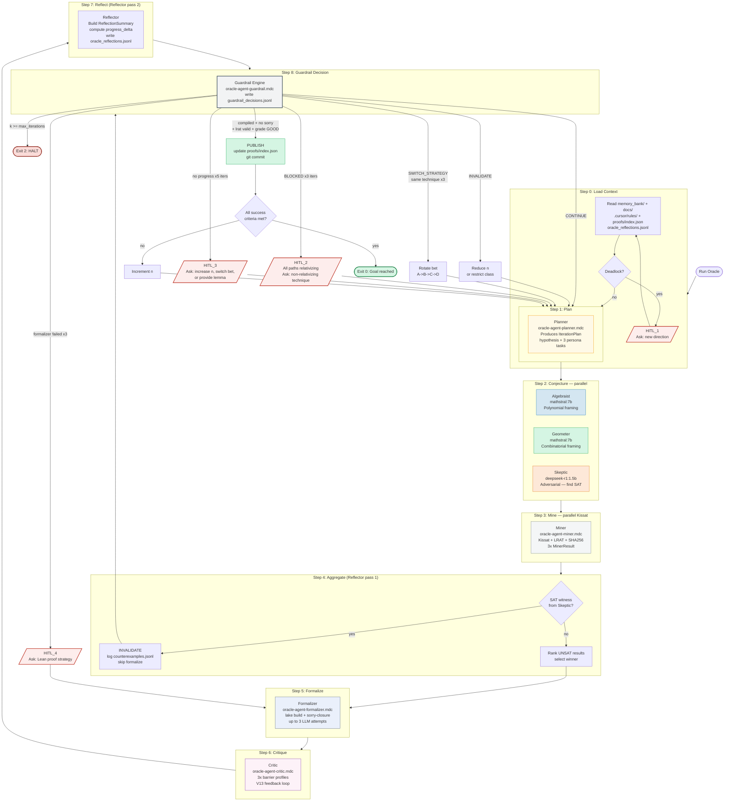

# ORACLE: Multi-Agent Mathematical Research Loop

Works for any formal math research project. Reads project context at startup.
Runs until a goal is reached, a HALT condition fires, or a human is needed.

## Flow Overview



## Step 0: Load Context (always first)

Read these files before anything else:

- `memory_bank/mmemory_bank_projectbrief.md` -> problem_statement, success_criteria
- `memory_bank/mmemory_bank_activeContext.md` -> current_progress, open_tasks
- `memory_bank/mmemory_bank_progress.md` -> what works, known failures
- `memory_bank/mmemory_bank_systemPatterns.md` -> architecture constraints
- `docs/brainlift/saturday-dev-checklist-v2.md` -> open conjectures
- `infra/config/defaults.yaml` -> system config (models, seeds, max_n)
- `.cursor/rules/*.mdc` -> behavioral constraints (no emojis, no cloud, etc.)
- `search/logs/oracle_reflections.jsonl` -> last entry (prior iteration state)
- `search/logs/guardrail_decisions.jsonl` -> last entry (prior decision)
- `proofs/index.json` -> verified artifact inventory

Construct `ResearchContext` mentally. If `oracle_reflections.jsonl` has no entries,
this is iteration 0 (fresh start).

Check for immediate deadlock: if `known_barriers` shows all bets blocked with no
open conjectures, trigger **HITL_1** before starting the loop.

## Step 1: Plan (invoke oracle-agent-planner rule)

Read `.cursor/rules/oracle-agent-planner.mdc`. Follow it exactly.

Produce `IterationPlan` with:
- A falsifiable `hypothesis`
- Three distinct `persona_assignments` (algebraist task / geometer task / skeptic task)
- A `parameter_range` (specific n values, not open-ended)
- A `fallback_strategy`

Log to `search/logs/oracle_planner.jsonl`.

## Step 2: Generate Conjectures in Parallel (3 subagents)

Invoke all three persona rules. Run their tasks concurrently (3 parallel tool calls).

**Algebraist** - read `.cursor/rules/oracle-agent-algebraist.mdc`
Run: `python -c "from search.agents.conjecturer import AlgebraistPersona; ..."`
Or invoke existing `satday mine` with algebraic framing.

**Geometer** - read `.cursor/rules/oracle-agent-geometer.mdc`
Run: `python -c "from search.agents.conjecturer import GeometerPersona; ..."`

**Skeptic** - read `.cursor/rules/oracle-agent-skeptic.mdc`
Run: `python -c "from search.agents.conjecturer import SkepticPersona; ..."`
Note: Skeptic's CNF asks if a circuit EXISTS (adversarial), not that none exists.

Each produces: `{lean_stub, cnf_spec, proof_sketch, barrier_risk}` or `{cnf_spec}` for Skeptic.

## Step 3: Mine (invoke oracle-agent-miner rule)

Read `.cursor/rules/oracle-agent-miner.mdc`. Follow it exactly.

Run Kissat on all 3 CNF specs. Use existing infrastructure:
```bash
python -m search.agents.miner --config infra/config/defaults.yaml --spec {cnf_spec_path}
```
Or invoke the supervisor with the 3 specs in sequence.

Collect 3x `MinerResult`. Log to `search/logs/miner_results.jsonl`.

## Step 4: Aggregate (first Reflector pass)

Read `.cursor/rules/oracle-agent-reflector.mdc`, section "First Invocation: Post-Miner".

**If Skeptic returned SAT**: write to `search/logs/counterexamples.jsonl`, skip to Step 7
with decision=INVALIDATE.

**If all UNSAT**: rank by composite score, select winner for Formalizer.

## Step 5: Formalize (invoke oracle-agent-formalizer rule)

Read `.cursor/rules/oracle-agent-formalizer.mdc`. Follow it exactly.

Run:
```bash
python -m search.agents.formalizer --lrat-hash {hash} --hypothesis "{hypothesis}"
lake build {lean_file}
```

Produce `FormalResult`. If sorry present after 3 LLM attempts, mark `llm_attempts=3`.

## Step 6: Critique (invoke oracle-agent-critic rule)

Read `.cursor/rules/oracle-agent-critic.mdc`. Follow it exactly.

Pass ALL 3 ConjectureOutputs (not just the winner) to the Critic.
Run existing critic agent:
```bash
python -m search.agents.critic --proofs {all_three_lean_stubs} --report
```

Produce `CriticReport` with barrier profiles for all 3 approaches.

## Step 7: Reflect (second Reflector pass)

Read `.cursor/rules/oracle-agent-reflector.mdc`, section "Second Invocation: Post-Critic".

Build `ReflectionSummary`. Compute `progress_delta` vs. prior JSONL entry.
Write to `search/logs/oracle_reflections.jsonl`.

## Step 8: Guardrail Decision

Read `.cursor/rules/oracle-agent-guardrail.mdc`. Follow decision table exactly.

Write decision to `search/logs/guardrail_decisions.jsonl`.

Then execute the decision:

### PUBLISH
```bash
# Update proofs/index.json with new artifact
python search/tools/inspect_artifacts.py --register {lrat_hash}
# Commit
git add theory/Conjectures/ proofs/ search/logs/
git commit -m "Verify: {theorem_name} n={n} lrat={lrat_hash[:8]}"
# Update checklist
# Check if all success_criteria met -> if yes, print summary and EXIT
# If not, increment n and loop back to Step 1
```

### CONTINUE
Loop back to Step 1 with updated ResearchContext (inject ReflectionSummary).

### INVALIDATE
Reduce n by 1 (or restrict circuit class). Loop back to Step 1.

### SWITCH_STRATEGY
Rotate bet (A->B->C->D->A). Loop back to Step 1.

### HALT
```bash
# Write halt report
python search/reporting/md_reporter.py --halt --output docs/reports/halt_report_{timestamp}.md
git add docs/reports/ search/logs/
git commit -m "HALT: oracle loop exhausted after {k} iterations"
```
Print summary. Exit.

### HITL_1 through HITL_4
Print the specific prompt from the Guardrail rule (verbatim, do not paraphrase).
Wait for human input. Log response to `search/logs/hitl_interventions.jsonl`.
Inject response at the appropriate phase and continue loop.

## Loop Invariants (check every iteration)

- [ ] Every Kissat run used a fixed seed from IterationPlan.parameter_range.seed
- [ ] Every LRAT hash was verified by the LRAT checker before being accepted
- [ ] No cloud APIs were called (zero_cost_guard.py enforces this)
- [ ] All LLM calls used Ollama local models only
- [ ] ReflectionSummary was written to JSONL before GuardrailEngine ran
- [ ] GuardrailEngine decision was written to JSONL before acting on it

## Persona Rule Reference

| Phase | Subagent | Rule File |
|---|---|---|
| 1 | Planner | `.cursor/rules/oracle-agent-planner.mdc` |
| 2a | Algebraist | `.cursor/rules/oracle-agent-algebraist.mdc` |
| 2b | Geometer | `.cursor/rules/oracle-agent-geometer.mdc` |
| 2c | Skeptic | `.cursor/rules/oracle-agent-skeptic.mdc` |
| 3 | Miner | `.cursor/rules/oracle-agent-miner.mdc` |
| 4,7 | Reflector | `.cursor/rules/oracle-agent-reflector.mdc` |
| 5 | Formalizer | `.cursor/rules/oracle-agent-formalizer.mdc` |
| 6 | Critic | `.cursor/rules/oracle-agent-critic.mdc` |
| 8 | Guardrail | `.cursor/rules/oracle-agent-guardrail.mdc` |

## Adapting to a Different Math Problem

Replace the memory bank files with those for the new project.
The loop structure, persona roles, guardrail conditions, and HITL triggers
are all project-agnostic. The only project-specific coupling is:
- `problem_statement` (from projectbrief.md)
- `oracle_type` (Kissat for SAT problems; swap for SMT/Groebner/other for different domains)
- `formal_verifier` (Lean 4 here; swap for Coq/Isabelle for other projects)
