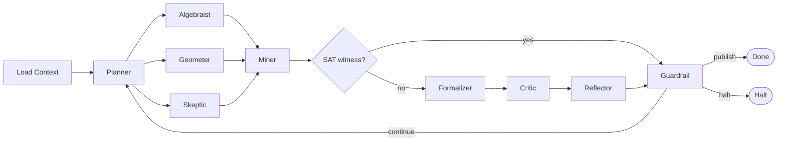

# ORACLE: Multi-Agent Mathematical Research Loop

Works for any formal math research project. Reads project context at startup.
Runs until a goal is reached, a HALT condition fires, or a human is needed.

Each step below that says "Spawn subagent" requires a REAL `Task` tool call — not
reading a rule in your own context. Subagents have isolated context. Pass all
necessary state explicitly in the prompt.

## Flow Overview

### Main Loop



### Guardrail Decisions


---

## Step 0: Load Context (orchestrating agent — no subagent)

Read these files directly before spawning anything:

- `memory_bank/mmemory_bank_projectbrief.md`
- `memory_bank/mmemory_bank_activeContext.md`
- `memory_bank/mmemory_bank_progress.md`
- `memory_bank/mmemory_bank_systemPatterns.md`
- `docs/brainlift/saturday-dev-checklist-v2.md`
- `infra/config/defaults.yaml`
- `search/logs/oracle_reflections.jsonl` (last entry if exists)
- `search/logs/guardrail_decisions.jsonl` (last entry if exists)
- `proofs/index.json`

Construct `ResearchContext` in memory. If `oracle_reflections.jsonl` is empty,
this is iteration 0.

If all bets are blocked with no open conjectures: trigger HITL_1 now (print prompt,
wait for human input) before continuing.

---

## Step 1: Planner (spawn subagent)

Spawn a `generalPurpose` subagent. The prompt must be fully self-contained.

```
Task tool call:
  subagent_type: generalPurpose
  description: "ORACLE Planner - iteration {k}"
  prompt: |
    You are the Planner subagent in the ORACLE mathematical research loop.

    First, read this rule file in full:
      .cursor/rules/oracle-agent-planner.mdc

    Your inputs for this iteration:
      ResearchContext: {paste ResearchContext JSON here}
      Prior ReflectionSummary: {paste last entry from oracle_reflections.jsonl, or "none"}
      GuardrailEngine next_action: {paste last guardrail decision action, or "fresh start"}

    Execute your role exactly as the rule specifies.

    Return ONLY a JSON block with this structure:
    {
      "iteration": <k>,
      "hypothesis": "<falsifiable statement>",
      "decomposed_tasks": [...],
      "success_criteria": {...},
      "fallback_strategy": "<string>",
      "persona_assignments": {
        "algebraist": "<specific task>",
        "geometer": "<specific task>",
        "skeptic": "<specific task>"
      },
      "parameter_range": {"n_min": <int>, "n_max": <int>, "seed": <int>, "circuit_class": "<string>"}
    }

    Write the JSON to search/logs/oracle_planner.jsonl as a new line.
```

Collect the `IterationPlan` JSON from the subagent's output before proceeding.

---

## Step 2: Conjecture Generation (3 parallel subagents)

Spawn ALL THREE in the SAME message (parallel dispatch — one message, three Task calls).
Each prompt is self-contained and receives the IterationPlan from Step 1.

### Task call A — Algebraist
```
  subagent_type: generalPurpose
  description: "ORACLE Algebraist - iteration {k}"
  prompt: |
    You are the Algebraist subagent in the ORACLE mathematical research loop.

    First, read this rule file in full:
      .cursor/rules/oracle-agent-algebraist.mdc

    Your IterationPlan for this iteration:
      {paste full IterationPlan JSON from Step 1}

    Your specific task: {paste IterationPlan.persona_assignments.algebraist}

    Execute your role exactly as the rule specifies. Use Ollama local model
    mathstral:7b via: ollama run mathstral:7b

    Return ONLY a JSON block:
    {
      "persona": "algebraist",
      "lean_stub": "<full Lean 4 theorem text>",
      "cnf_spec": {...},
      "proof_sketch": "<natural language>",
      "barrier_risk": "algebraization|safe|unknown",
      "technique_used": "<string>"
    }

    Write the CNF spec to search/specs/ and the lean stub to
    theory/Conjectures/ using the naming convention in the rule.
```

### Task call B — Geometer
```
  subagent_type: generalPurpose
  description: "ORACLE Geometer - iteration {k}"
  prompt: |
    You are the Geometer subagent in the ORACLE mathematical research loop.

    First, read this rule file in full:
      .cursor/rules/oracle-agent-geometer.mdc

    Your IterationPlan for this iteration:
      {paste full IterationPlan JSON from Step 1}

    Your specific task: {paste IterationPlan.persona_assignments.geometer}

    Execute your role exactly as the rule specifies. Use Ollama local model
    mathstral:7b via: ollama run mathstral:7b

    Return ONLY a JSON block:
    {
      "persona": "geometer",
      "lean_stub": "<full Lean 4 theorem text>",
      "cnf_spec": {...},
      "proof_sketch": "<natural language>",
      "natural_proof_risk": "high|low|unknown",
      "key_object": "<combinatorial object>",
      "technique_used": "<string>"
    }

    Write the CNF spec to search/specs/ and the lean stub to
    theory/Conjectures/ using the naming convention in the rule.
```

### Task call C — Skeptic
```
  subagent_type: generalPurpose
  description: "ORACLE Skeptic - iteration {k}"
  prompt: |
    You are the Skeptic subagent in the ORACLE mathematical research loop.

    First, read this rule file in full:
      .cursor/rules/oracle-agent-skeptic.mdc

    Your IterationPlan for this iteration:
      {paste full IterationPlan JSON from Step 1}

    Your specific task: {paste IterationPlan.persona_assignments.skeptic}

    Execute your role exactly as the rule specifies. Use Ollama local model
    deepseek-r1:1.5b via: ollama run deepseek-r1:1.5b

    You are adversarial. Generate a CNF spec that asks whether a circuit
    of size SMALLER than the claimed lower bound EXISTS (not that none exists).
    This is the complement of what the other personas generate.

    Return ONLY a JSON block:
    {
      "persona": "skeptic",
      "cnf_spec": {...},
      "circuit_size_tested": <int>,
      "outcome": "pending"
    }

    Write the CNF spec to search/specs/ using the naming convention in the rule.
```

Wait for all three to complete before proceeding.

---

## Step 3: Miner (spawn shell subagent)

Spawn a `shell` subagent to run Kissat on all three CNF specs.

```
Task tool call:
  subagent_type: shell
  description: "ORACLE Miner - run Kissat on 3 specs"
  prompt: |
    Run Kissat on the following three CNF spec files produced in this iteration.
    For each, use the existing infrastructure:

    1. cd /Users/nmm/Development/SATurday
    2. For each spec file path below, run:
         python -m search.agents.miner \
           --config infra/config/defaults.yaml \
           --spec {spec_file_path}
    
    Spec files (from Step 2 outputs):
      - Algebraist spec: {cnf_spec path from algebraist output}
      - Geometer spec:   {cnf_spec path from geometer output}
      - Skeptic spec:    {cnf_spec path from skeptic output}

    For each run, capture:
      - outcome: UNSAT | SAT | TIMEOUT | ERROR
      - lrat_hash (if UNSAT)
      - sat_assignment (if SAT — this is a counterexample)
      - solve_time_s
      - cnf_vars, cnf_clauses

    Append all three results as JSON lines to search/logs/miner_results.jsonl.

    Return a JSON array of three MinerResult objects.
```

---

## Step 4: Aggregate (orchestrating agent — no subagent)

Evaluate the three MinerResults yourself:

- If Skeptic's result is SAT: write the witness to `search/logs/counterexamples.jsonl`,
  set decision = INVALIDATE, skip Steps 5 and 6, go directly to Step 8.
- If all UNSAT or TIMEOUT: rank by `(1/solve_time_s)*0.4 + (clauses/vars)*0.3`.
  Select the highest-scoring UNSAT result as the winner for formalization.

---

## Step 5: Formalizer (spawn subagent)

Spawn a `generalPurpose` subagent with the winning MinerResult.

```
Task tool call:
  subagent_type: generalPurpose
  description: "ORACLE Formalizer - iteration {k}"
  prompt: |
    You are the Formalizer subagent in the ORACLE mathematical research loop.

    First, read this rule file in full:
      .cursor/rules/oracle-agent-formalizer.mdc

    Winning MinerResult:
      {paste winning MinerResult JSON}

    Conjecture output that produced this result:
      {paste winning ConjectureOutput JSON — algebraist or geometer}

    Execute your role exactly as the rule specifies:
    1. Generate a Lean 4 theorem embedding the LRAT hash
    2. Run: lake build <theorem_file>
    3. If sorry present, attempt close_sorry_with_llm up to 3 times
       using: python -m search.agents.formalizer --close-sorry <file>
    4. Run lake build after each attempt

    Return ONLY a JSON block:
    {
      "lean_file": "<path>",
      "compiled": <bool>,
      "has_sorry": <bool>,
      "sorry_count": <int>,
      "axioms_used": [...],
      "lrat_hash": "<hash>",
      "llm_attempts": <int>
    }
```

---

## Step 6: Critic (spawn subagent)

Spawn a `generalPurpose` subagent. Pass ALL three conjecture outputs, not just the winner.

```
Task tool call:
  subagent_type: generalPurpose
  description: "ORACLE Critic - iteration {k}"
  prompt: |
    You are the Critic subagent in the ORACLE mathematical research loop.

    First, read this rule file in full:
      .cursor/rules/oracle-agent-critic.mdc

    All three conjecture outputs from this iteration:
      Algebraist: {paste algebraist ConjectureOutput JSON}
      Geometer:   {paste geometer ConjectureOutput JSON}
      Skeptic:    {paste skeptic SkepticOutput JSON}

    Formalization result:
      {paste FormalResult JSON from Step 5}

    Execute your role exactly as the rule specifies:
    - Score all 3 approaches for relativization, natural proofs, algebraization
    - Run V13 feedback loop if any approach is relativizing
    - Assign overall_grade

    Return ONLY a JSON block:
    {
      "all_barrier_profiles": [...],
      "winner_barrier_profile": {...},
      "best_barrier_approach": "algebraist|geometer|skeptic",
      "overall_grade": "EXCELLENT|GOOD|MODERATE|CAUTION|BLOCKED",
      "v13_proposals": [...],
      "recommendations": [...],
      "block_detected": <bool>
    }
```

---

## Step 7: Reflect (orchestrating agent — no subagent)

Build the ReflectionSummary yourself from all collected outputs:

```json
{
  "iteration": <k>,
  "hypothesis_tested": "<from IterationPlan>",
  "algebraist_outcome": "<UNSAT in Xs | TIMEOUT | skipped>",
  "geometer_outcome": "<UNSAT in Xs | TIMEOUT | skipped>",
  "skeptic_outcome": "<no witness | SAT witness: N gates>",
  "formalization_status": "<compiled | sorry(N) | failed | skipped>",
  "barrier_grade": "<from CriticReport.overall_grade>",
  "best_barrier_approach": "<from CriticReport>",
  "progress_delta": "<POSITIVE | NEUTRAL | NEGATIVE vs prior entry>",
  "open_questions": [...]
}
```

Compare to prior entry in `search/logs/oracle_reflections.jsonl` to compute
`progress_delta`. Append the ReflectionSummary as a new line to that file.

---

## Step 8: Guardrail Decision (orchestrating agent — no subagent)

Evaluate the decision table in order (first match wins). Maintain running counts
across iterations in memory:

| Condition | Decision |
|---|---|
| compiled=true AND has_sorry=false AND lrat valid AND grade in GOOD/EXCELLENT | PUBLISH |
| skeptic_outcome contains "SAT witness" | INVALIDATE |
| barrier_grade=BLOCKED for 3+ consecutive iterations | HITL_2 |
| formalizer compiled=false for 3+ consecutive iterations | HITL_4 |
| progress_delta=NEGATIVE for 5+ consecutive iterations | HITL_3 |
| same technique 3+ consecutive iterations | SWITCH_STRATEGY |
| iteration_count >= max_iterations (default 50) | HALT |
| default | CONTINUE |

Write decision + full ReflectionSummary to `search/logs/guardrail_decisions.jsonl`.

Then execute:

**PUBLISH**
```bash
python search/tools/inspect_artifacts.py --register {lrat_hash}
git add theory/Conjectures/ proofs/ search/logs/
git commit -m "Verify: {theorem_name} n={n} lrat={lrat_hash[:8]}"
```
Check if all success_criteria met. If yes: print summary, exit. If no: increment n,
loop back to Step 1.

**CONTINUE** — loop back to Step 1 with updated ResearchContext.

**INVALIDATE** — reduce n by 1, loop back to Step 1.

**SWITCH_STRATEGY** — rotate bet (A->B->C->D->A), loop back to Step 1.

**HALT**
```bash
python search/reporting/md_reporter.py --halt \
  --output docs/reports/halt_report_{timestamp}.md
git add docs/reports/ search/logs/
git commit -m "HALT: oracle loop exhausted after {k} iterations"
```

**HITL_1 through HITL_4** — print the verbatim prompt from the relevant guardrail
rule. Wait for human text input. Log to `search/logs/hitl_interventions.jsonl`.
Inject into the appropriate step and continue.

---

## Loop Invariants (check every iteration)

- [ ] Kissat runs used fixed seed from IterationPlan.parameter_range.seed
- [ ] Every LRAT hash verified by LRAT checker before accepting
- [ ] No cloud APIs called (zero_cost_guard.py enforces this)
- [ ] All LLM calls used Ollama local models only
- [ ] ReflectionSummary written to JSONL before Guardrail evaluated
- [ ] Guardrail decision written to JSONL before acting on it

---

## Persona Rule Reference

| Phase | Subagent | Rule File | Spawned via |
|---|---|---|---|
| 1 | Planner | `.cursor/rules/oracle-agent-planner.mdc` | Task generalPurpose |
| 2a | Algebraist | `.cursor/rules/oracle-agent-algebraist.mdc` | Task generalPurpose (parallel) |
| 2b | Geometer | `.cursor/rules/oracle-agent-geometer.mdc` | Task generalPurpose (parallel) |
| 2c | Skeptic | `.cursor/rules/oracle-agent-skeptic.mdc` | Task generalPurpose (parallel) |
| 3 | Miner | `.cursor/rules/oracle-agent-miner.mdc` | Task shell |
| 4 | Reflector pass 1 | `.cursor/rules/oracle-agent-reflector.mdc` | orchestrating agent |
| 5 | Formalizer | `.cursor/rules/oracle-agent-formalizer.mdc` | Task generalPurpose |
| 6 | Critic | `.cursor/rules/oracle-agent-critic.mdc` | Task generalPurpose |
| 7 | Reflector pass 2 | `.cursor/rules/oracle-agent-reflector.mdc` | orchestrating agent |
| 8 | Guardrail | `.cursor/rules/oracle-agent-guardrail.mdc` | orchestrating agent |

---

## Adapting to a Different Math Problem

Replace the memory bank files with those for the new project.
The only project-specific coupling is:
- `problem_statement` (from projectbrief.md)
- `oracle_type` (Kissat for SAT; swap for SMT/Groebner/other domains)
- `formal_verifier` (Lean 4 here; swap for Coq/Isabelle)
