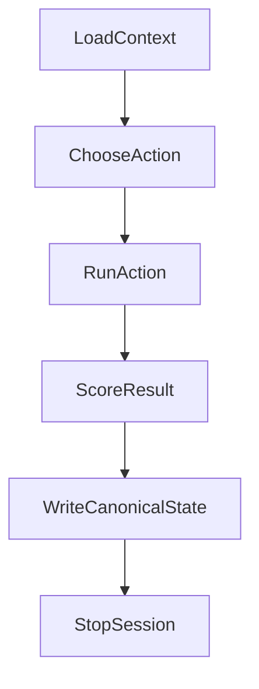

# SATURDAY

## Purpose

Run exactly one high value research action per session, write one canonical state
record, update the solve checklist, and stop. This minimizes orchestration overhead
and keeps progress auditable.

## Session Contract

- One decision.
- One action.
- One canonical state write.
- One checklist update (at least one item marked done, if the action succeeds).
- Stop.



## Canonical Action Types

- `prove_step`: close one frontier Lean node.
- `mine_step`: generate one LRAT backed SAT result and optional Lean anchor.
- `new_math_step`: generate one barrier-aware hypothesis and run one immediate falsifiable check.

## Step 0: Load Context

Read:

- `memory_bank/mmemory_bank_activeContext.md`
- `memory_bank/mmemory_bank_progress.md`
- `memory_bank/mmemory_bank_systemPatterns.md`
- `search/logs/saturday_sessions.jsonl` (last line if present)
- `search/logs/proof_sprint_log.jsonl` (last line if present)
- `search/logs/miner_results.jsonl` (last line if present)
- `search/logs/new_math_proposals.jsonl` (last line if present)
- `docs/p-vs-np-solve-checklist.md`

Run sorry inventory:

```bash
WORKSPACE=$(git rev-parse --show-toplevel)
cd "$WORKSPACE/theory" && rg ":= sorry|^ *sorry$" --glob "*.lean"
```

Run disk check:

```bash
WORKSPACE=$(git rev-parse --show-toplevel)
df -h "$WORKSPACE" | awk 'NR==2 {print}'
```

Build `SessionState`:

```json
{
  "session_id": "<unix_ts_or_counter>",
  "sorry_frontier_count": "<int>",
  "next_checklist_item": "<first unchecked checklist line>",
  "last_action_type": "prove_step|mine_step|new_math_step|none",
  "last_result": "success|partial|blocked|none",
  "disk_free_gb": "<float>"
}
```

## Step 1: Choose Action

Choose exactly one action using this priority:

0. First unchecked item in `docs/p-vs-np-solve-checklist.md` drives target selection.
   Prefer an action that can concretely complete that item in one cycle.

1. If a frontier sorry is currently closable with existing lemmas/certificates: `prove_step`.
2. Else if a blocked frontier node can be reduced to SAT certificate generation: `mine_step`.
3. Else: `new_math_step`.

Output:

```json
{
  "action_type": "prove_step|mine_step|new_math_step",
  "target": "<single theorem, SAT instance, or hypothesis>",
  "rationale": "<one sentence>",
  "action_config": {}
}
```

## Step 2: Run Action

- If `action_type=prove_step`: execute `.cursor/skills/proof-sprint/SKILL.md` as one node close attempt.
- If `action_type=mine_step`: execute `.cursor/skills/run-oracle/SKILL.md` as one mine cycle (no internal loop).
- If `action_type=new_math_step`: execute `.cursor/skills/new-math/SKILL.md` through hypothesis plus immediate falsifiable check.

Each action returns:

```json
{
  "status": "success|partial|blocked",
  "artifact_refs": ["<paths_or_hashes>"],
  "barrier_assessment": {
    "relativization": "blocked|evades|unclear",
    "natural_proofs": "blocked|evades|unclear",
    "algebraization": "blocked|evades|unclear"
  },
  "next_recommended_action": "prove_step|mine_step|new_math_step"
}
```

## Step 3: Write Canonical State

Append exactly one JSON line to `search/logs/saturday_sessions.jsonl`:

```json
{
  "session_id": "<id>",
  "action_type": "prove_step|mine_step|new_math_step",
  "target": "<target>",
  "result": "success|partial|blocked",
  "barrier_assessment": {
    "relativization": "blocked|evades|unclear",
    "natural_proofs": "blocked|evades|unclear",
    "algebraization": "blocked|evades|unclear"
  },
  "artifact_refs": ["<paths_or_hashes>"],
  "next_recommended_action": "prove_step|mine_step|new_math_step",
  "timestamp": "<unix>"
}
```

Then update checklist:

- In `docs/p-vs-np-solve-checklist.md`, mark completed item(s) `[x]`.
- Keep the update minimal: only items directly completed by this single cycle.
- Do not mark speculative or partial work as complete.

Stop immediately after writing this record.

## Invariants

- Local only execution.
- Deterministic seeds for SAT/solver work.
- No internal multi-iteration loop inside a single session.
- Exactly one canonical state record per session.
- Checklist integrity: only evidence-backed checkoffs.

## References

- `.cursor/skills/run-oracle/SKILL.md`
- `.cursor/skills/proof-sprint/SKILL.md`
- `.cursor/skills/new-math/SKILL.md`
