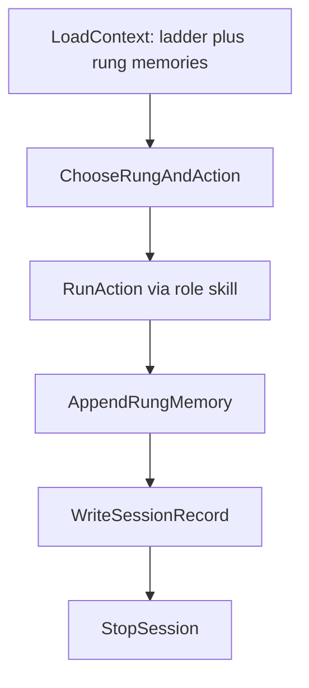

# SATURDAY

## Purpose

Run exactly one high value research action per session against one ladder rung,
append the result to that rung's memory, write one canonical session record, and
stop. The ladder (docs/ladder/ladder.md) is the single source of truth for what the
program is climbing.

## Local CLI (preferred offline path)

```bash
pip install -e .
satday saturday --dry-run
satday saturday --action prove --rung r5-cook-reckhow-bridge
satday saturday --action falsify
satday saturday --parallel
satday status
satday status --json
satday loop --parallel --cycles 3 --sleep 90
```

Config: `saturday_loop` in `infra/config/defaults.yaml`. Shared client:
`search/llm/client.py`. Cursor skill remains valid for interactive sessions;
the CLI is the privacy preserving default. Ollama must be serving before prove,
formalize, or audit. `satday status` does not call an LLM.

`--parallel` runs one cycle on each disjoint workstream (R2 and R5) in one wake.
`satday loop` repeats wakes with sleep between; use `--cycles 0` (or config
`loop_max_cycles: 0`) to run until Ctrl-C.

## Session Contract

- One rung.
- One action.
- One rung memory append.
- One canonical session record.
- Stop.



## Action Types

- `prove`: one prose proof attempt on the chosen rung (skill: prover).
- `formalize`: one Lean formalization push for a prose argument that passed its
  gate (skill: formalizer).
- `falsify`: one bounded empirical attack or calibration run (skill: falsifier).
- `audit`: one barrier and soundness audit of a rung or argument
  (skill: barrier-auditor).

## Step 0: Load Context

Read:

- `docs/ladder/ladder.md`
- the memory file of every rung with status active or prose_accepted
  (`docs/ladder/rungs/`)
- `search/logs/saturday_sessions.jsonl` (last line if present)
- `docs/p-vs-np-solve-checklist.md`
- `docs/p-vs-np-stop-conditions.md` (budget caps)

Run sorry inventory (accepted tree must be clean; Frontier namespaces are reported
separately):

```bash
WORKSPACE=$(git rev-parse --show-toplevel)
cd "$WORKSPACE/theory" && rg -n "sorry" --glob "*.lean" Theory/ | rg -v "Frontier" || echo "accepted tree clean"
```

Run disk check:

```bash
WORKSPACE=$(git rev-parse --show-toplevel)
df -h "$WORKSPACE" | awk 'NR==2 {print}'
```

## Step 1: Choose Rung and Action

Priority:

1. The lowest rung whose status is active drives the session.
2. On that rung: if a prose argument passed audit and the human gate, `formalize`.
3. Else if the rung needs mathematical content, `prove`.
4. Else if the rung's falsification or calibration test has not run, `falsify`.
5. Else `audit`.
6. If every active rung is blocked twice for the same cause, this session must
   change approach or propose a kill decision (stop conditions).

Output:

```json
{
  "rung": "<rung id, for example r0-resolution-foundations>",
  "action_type": "prove|formalize|falsify|audit",
  "target": "<single statement, module, or family>",
  "rationale": "<one sentence>"
}
```

## Step 2: Run Action

- `prove`: execute `.cursor/skills/prover/SKILL.md`.
- `formalize`: execute `.cursor/skills/formalizer/SKILL.md`.
- `falsify`: execute `.cursor/skills/falsifier/SKILL.md`.
- `audit`: execute `.cursor/skills/barrier-auditor/SKILL.md`.

Each role skill returns:

```json
{
  "status": "success|partial|blocked",
  "artifact_refs": ["<paths or hashes>"],
  "notes": "<what a reader needs to know, complete sentences>",
  "next_recommended_action": "prove|formalize|falsify|audit"
}
```

## Step 3: Append Rung Memory

Append one dated entry to the rung's Session log section in
`docs/ladder/rungs/<rung>.md`. Entries are append only; never rewrite or delete
earlier entries. The entry records: action, result, artifacts, and the single most
important thing learned.

## Step 4: Write Session Record

Append exactly one JSON line to `search/logs/saturday_sessions.jsonl`:

```json
{
  "session_id": "<unix timestamp>",
  "rung": "<rung id>",
  "action_type": "prove|formalize|falsify|audit",
  "target": "<target>",
  "result": "success|partial|blocked",
  "artifact_refs": ["<paths or hashes>"],
  "gate_pending": "none|adopt_rung|accept_prose|merge_certified|kill_rung",
  "next_recommended_action": "prove|formalize|falsify|audit",
  "timestamp": "<unix>",
  "notes": "<optional; include workstream id when running in parallel>"
}
```

Then update the checklist minimally: in `docs/p-vs-np-solve-checklist.md`, mark
only items directly completed by this cycle. No speculative checkoffs.

## Human Gates (30 second autonomy under loop)

Three decisions are recorded as `gate_pending` in the session record and presented
at session end:

- adopting or killing a rung (ladder status change to active or killed),
- accepting a prose proof for formalization (status prose_accepted),
- merging a certified result into the accepted tree (status certified).

### Interactive (no `/loop`)

Stop after the session record and wait for an explicit human reply before the
next cycle. Do not self approve.

### Under `/loop` saturday (autonomous)

1. Present the pending gate in one short question at session end.
2. Do not block the research program on silence. If no human reply arrives
   within **30 seconds** of presenting the gate, apply best judgment and
   continue on the next tick (or immediately if the same turn must choose).
3. Best judgment defaults:
   - `accept_prose`: approve when the prose is coherent, matches the critical
     path, and does not revive a twice blocked method.
   - `merge_certified`: approve when `scripts/check_axioms.sh` PASS and the
     new decls are listed in `scripts/accepted_declarations.txt`.
   - `adopt_rung` / `kill_rung`: only auto apply when stop conditions already
     force the change; otherwise leave pending and work a parallel active rung
     (for example R5) until a human replies.
4. Record the auto decision in the next session notes with `gate_auto: true`
   and one sentence of rationale. Never stall a loop tick waiting for chat.

## Parallelization (Multitask Mode)

Core contract is unchanged: **each agent still runs exactly one cycle** (one
rung, one action, one rung memory append, one session record) per wake. Do not
collapse multiple cycles into one agent turn.

When Multitask Mode or multiple agents are available, a **coordinator** may
launch independent workstreams in parallel. Typical split: R2 Block A and R5
Block D. Never assign two agents to the same Lean module or the same rung
memory file at the same time.

### Disjoint ownership

| Workstream | Rung memory (exclusive) | Lean targets (exclusive) |
| --- | --- | --- |
| R2 | `docs/ladder/rungs/r2-width-machinery.md` | Tseitin / CSExpansion related Lean under `theory/Theory/ProofComplexity/` (not under `Bridge/`) |
| R5 | `docs/ladder/rungs/r5-cook-reckhow-bridge.md` | Bridge Lean under `theory/Theory/ProofComplexity/Bridge/` |

Parallel agents must use disjoint targets and files only. If a needed edit would
cross ownership, serialize that work on one agent or wait for the other cycle to
finish.

### Session records under parallel cycles

Each parallel cycle still appends exactly one JSON line to
`search/logs/saturday_sessions.jsonl`. Include a workstream id in `notes` when
helpful (for example `workstream: R2` or `workstream: R5`). Do not merge two
cycles into one session line.

### Human gates

Same Human Gates rules apply per cycle, including the **30 second** autonomy
defaults under `/loop`. Each parallel agent presents its own gate; silence is
handled independently per the defaults above.

### Loop arming (global singleton)

Keep **exactly one** saturday wake loop armed globally. Parallel agents must
**not** each arm a duplicate `AGENT_LOOP_WAKE_saturday` (or equivalent) loop.
Prefer: only the coordinator (parent) re-arms after all parallel cycles finish.
If a child agent would otherwise re-arm, skip arming and report done to the
parent. Cadence stays **dynamic one-shot wakes** (sleep then wake with a delay
fit to the work). Never leave a fixed `while true; sleep 1800` saturday loop
running.

## Invariants

- Local only execution. Deterministic seeds for solver work.
- No internal multi-iteration loop inside a single session.
- Exactly one canonical session record per session (per agent cycle).
- Accepted tree stays clean: zero sorries, standard axioms only
  (scripts/check_axioms.sh).
- Budgets from docs/p-vs-np-stop-conditions.md are enforced by tooling; a session
  never leaves a solver running past session end.
- Generated prose avoids hyphens as punctuation; spell connections in words. File
  names and existing identifiers are exempt.
- Parallel agents use disjoint ownership only; one global saturday wake loop.

## References

- `.cursor/skills/prover/SKILL.md`
- `.cursor/skills/formalizer/SKILL.md`
- `.cursor/skills/falsifier/SKILL.md`
- `.cursor/skills/barrier-auditor/SKILL.md`
- `docs/ladder/ladder.md`
