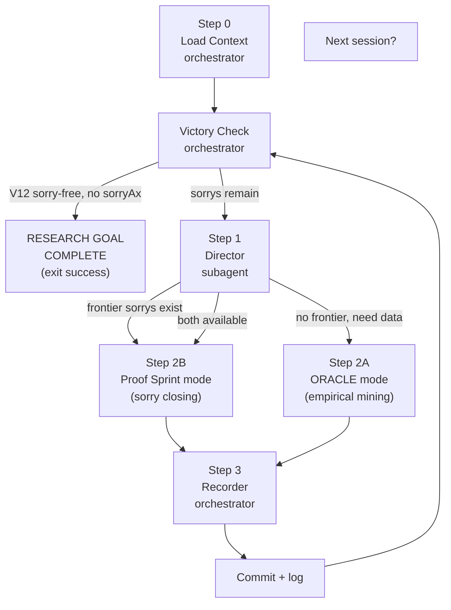

# SATURDAY: Unified Research Loop

## Purpose

Make compounding progress toward a formal proof of a non-trivial circuit lower bound
in Lean 4, as a concrete step toward P vs NP.

Each session does exactly one of:
- **Mine** — run the ORACLE loop to generate new LRAT-certified lower bound evidence
- **Prove** — run the proof-sprint loop to close one Lean sorry using that evidence

The Director decides which. You never have to choose.

## The Loop



---

## Step 0: Load Context (orchestrator — no subagent)

Read these files directly before spawning anything:

- `memory_bank/mmemory_bank_activeContext.md`
- `memory_bank/mmemory_bank_progress.md`
- `search/logs/proof_sprint_log.jsonl` — last entry if exists (`tail -1`)
- `search/logs/oracle_reflections.jsonl` — last entry if exists (`tail -1`)
- `search/logs/guardrail_decisions.jsonl` — last entry if exists (`tail -1`)

Run the sorry inventory:
```bash
cd /Users/nmm/Development/SATurday/theory && \
  grep -rn ":= sorry\|^ *sorry$" --include="*.lean" | grep -v "^Binary"
```

Run the disk check:
```bash
df -h /Users/nmm/Development/SATurday | tail -1
```

If free space is under 3GB: skip any step that would generate large CNF or LRAT files.

Construct `SessionState`:
```json
{
  "sorry_map": [...],
  "last_oracle_action": "...",
  "last_sprint_status": "...",
  "disk_free_gb": <float>
}
```

---

## Victory Check (orchestrator — run after Step 0 and after every commit)

Run this shell block. If it returns DONE, stop the loop immediately and print
the victory message below. Do not spawn the Director.

```bash
# Count sorrys in the V12 proof chain files only (not stubs or mathlib)
V12_SORRYS=$(cd /Users/nmm/Development/SATurday/theory && \
  grep -rn ":= sorry\|^ *sorry$" \
    Conjectures/BetA/Proofs/MonotoneParityInductive.lean \
    Theory/Sunflower.lean \
    --include="*.lean" 2>/dev/null | wc -l | tr -d ' ')

echo "V12_SORRYS=$V12_SORRYS"

if [ "$V12_SORRYS" = "0" ]; then
  # Secondary check: confirm no sorryAx in the theorem's axiom set
  cd /Users/nmm/Development/SATurday/theory
  lake build 2>/dev/null
  SORRY_AX=$(lake env lean --stdin 2>&1 <<'LEAN'
#print axioms monotone_parity_exponential_lower_bound_v12
LEAN
)
  echo "$SORRY_AX" | grep -q "sorryAx" && echo "SORRY_AX_FOUND" || echo "DONE"
fi
```

If the output contains `DONE`:

1. Write to `search/logs/saturday_sessions.jsonl`:
   ```json
   {"session": <N>, "mode": "victory", "target": "monotone_parity_exponential_lower_bound_v12",
    "outcome": "complete", "barrier_tag": "relativization_safe", "timestamp": <unix>}
   ```

2. Commit:
   ```bash
   cd /Users/nmm/Development/SATurday
   git add -f theory/ search/logs/
   git commit -m "Saturday session <N>: RESEARCH GOAL COMPLETE V12 sorry-free"
   ```

3. Print verbatim:
   ```
   ============================================================
   RESEARCH GOAL COMPLETE
   ============================================================
   Theorem: monotone_parity_exponential_lower_bound_v12
   Statement: For all n >= 2, any monotone circuit computing parity-n has size >= 2^(n/4).
   Status: Fully proved in Lean 4. No sorry. No sorryAx.
   Axiom baseline: lrat_implies_lower_bound, sunflower_lemma, synthesis_encoding_correct,
                   lrat_checker_sound, Classical.choice, propext, Quot.sound, funext
   Next step: Human review. Consider submitting to Lean community or arXiv.
   ============================================================
   ```

4. Exit. Do not run Step 1 or any further steps.

---

## Step 1: Director (spawn subagent)

```
Task tool call:
  subagent_type: generalPurpose
  description: "Saturday Director"
  prompt: |
    You are the Director of a P vs NP research project using Lean 4 and SAT solvers.

    Read these files first:
      memory_bank/mmemory_bank_activeContext.md
      .cursor/skills/proof-sprint/SKILL.md
      .cursor/skills/run-oracle/SKILL.md

    Current session state:
      {SESSION_STATE_JSON}

    Your job: decide whether this session should run ORACLE (empirical SAT mining)
    or proof-sprint (Lean sorry-closing), and name the single specific target.

    Decision rules (apply in order, first match wins):
    1. If any sorry in sorry_map has all its dependencies proved or axiom-only:
       -> mode = "prove", target = deepest such sorry toward V12.
    2. If last_sprint_status = "stuck" on the same theorem twice:
       -> mode = "mine", target = SAT encoding of the stuck sorry's content.
    3. If last_oracle_action = "PUBLISH" and a new LRAT hash was just anchored:
       -> mode = "prove", target = the sorry that LRAT hash closes.
    4. Default:
       -> mode = "mine", target = next parameter range from active context.

    Return ONLY a JSON block:
    {
      "mode": "prove|mine",
      "target": "<theorem name or SAT instance description>",
      "rationale": "<one sentence>",
      "mode_config": {
        "if_prove": {
          "sorry_file": "<path>",
          "sorry_line": <int>,
          "proof_approach": "<informal sketch, no hyphens>"
        },
        "if_mine": {
          "n": <int>,
          "max_gates": <int>,
          "circuit_class": "monotone|ac0",
          "seed": <int>
        }
      }
    }
```

---

## Step 2A: ORACLE Mode

Follow the steps in `.cursor/skills/run-oracle/SKILL.md` starting at Step 1,
using the `mode_config.if_mine` values from the Director output as the
`parameter_range` for the Planner.

Return the `GuardrailDecision` when done.

---

## Step 2B: Proof Sprint Mode

Follow the steps in `.cursor/skills/proof-sprint/SKILL.md` starting at Step 1
(Navigator), passing the Director's `mode_config.if_prove` values as context
for the Navigator's target selection.

Return the `AttackerOutput` when done.

---

## Step 3: Recorder (orchestrator — no subagent)

Append one line to `search/logs/saturday_sessions.jsonl`:
```json
{
  "session": <N>,
  "mode": "prove|mine",
  "target": "...",
  "outcome": "closed|published|stuck|timeout",
  "barrier_tag": "...",
  "timestamp": <unix>
}
```

If outcome is "closed" or "published":
```bash
cd /Users/nmm/Development/SATurday
git add -f theory/ search/logs/ proofs/
git commit -m "Saturday session <N>: <mode> <target> (<outcome>)"
```

After the commit, run the **Victory Check** above.
If it returns `DONE`, stop and print the victory message.
Otherwise, print the session summary:

```
Session <N> complete.
Mode: <prove|mine>
Target: <theorem or SAT instance>
Outcome: <closed|published|stuck|timeout>
Next target: <what the Director would pick next, based on current state>
```

---

## Conventions

**C1 — Barrier tagging.**
Every theorem closed or LRAT anchor committed must carry a barrier tag.
No `unknown` tag is committed without a HITL checkpoint.

**C2 — No silent axioms.**
Every `axiom` added must have a named proof obligation in `EncodingCorrectness.lean`
or a direct analog.

**C3 — One node per session.**
Each session must close or publish at least one node. If zero: log the blocker,
print the HITL prompt from proof-sprint, and stop.

---

## Current Research Chain

```
TARGET: monotone_parity_exponential_lower_bound_v12
  (for all n >= 2, any monotone circuit computing parity-n has size >= 2^(n/4))

Proved (green, no sorry):
  monotone_parity_k_lower_bound   k = 2..8 (LRAT certified, C.size > 32)
  andGateSupportFamily            (noncomputable def, fully implemented)
  andGateFamilySizeLeCircuitSize  (lemma, fully proved)
  V12 n=2..8 branch               (closed via interval_cases + omega, session 2)

AC0 depth table (LRAT certified):
  parity-3, 4, 5 at depth 2 (UNSAT); parity-4 at depth 3 (SAT sanity check)

Open (sorry remaining):
  monotone_parity_sunflower_connection   (Theory/Sunflower.lean:196)
    needs: Razborov restriction argument (formalizing circuit restriction)
  V12 n>=9 branch                        (MonotoneParityInductive.lean)
    needs: sunflower connection OR LRAT certs for n=9..16+

Victory condition (triggers exit):
  Both files above have zero sorrys AND #print axioms shows no sorryAx
```

---

## Sub-skill Reference

| When... | Use... |
|---|---|
| Frontier sorrys exist | `.cursor/skills/proof-sprint/SKILL.md` |
| No frontier, need SAT data | `.cursor/skills/run-oracle/SKILL.md` |
| Both available | proof-sprint first |
| User says "run saturday" | this file |
