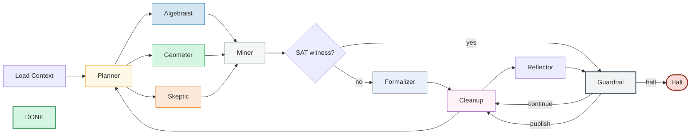
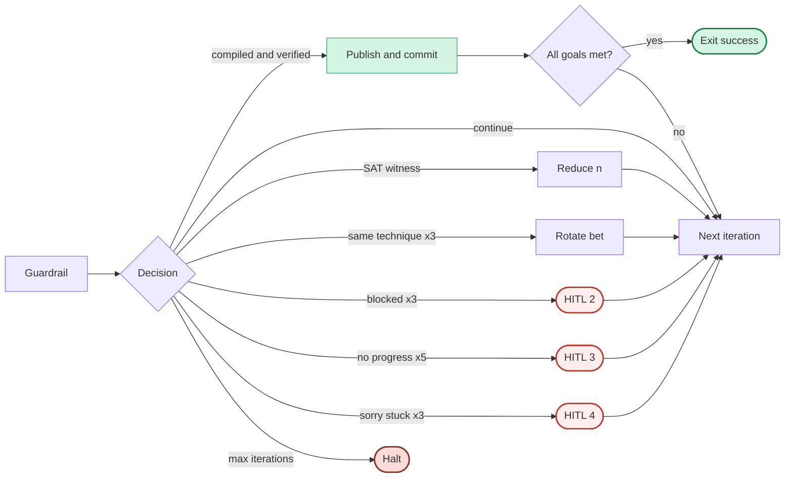

# ORACLE: Multi-Agent Mathematical Research Loop

## Main Loop

## Guardrail Decisions

## Subagent Rule Files

| Subagent | Role | Rule File | Model |
|---|---|---|---|
| Planner | Department Chair | `.cursor/rules/oracle-agent-planner.mdc` | rule-based |
| Algebraist | Formalist | `.cursor/rules/oracle-agent-algebraist.mdc` | mathstral:7b |
| Geometer | Visualizer | `.cursor/rules/oracle-agent-geometer.mdc` | mathstral:7b |
| Skeptic | Devil's Advocate | `.cursor/rules/oracle-agent-skeptic.mdc` | deepseek-r1:1.5b |
| Miner | Lab Technician | `.cursor/rules/oracle-agent-miner.mdc` | deterministic |
| Reflector | Editorial Board | `.cursor/rules/oracle-agent-reflector.mdc` | mathstral:7b |
| Formalizer | Proof-Writer | `.cursor/rules/oracle-agent-formalizer.mdc` | mathstral:7b |
| Critic | Peer Reviewer | `.cursor/rules/oracle-agent-critic.mdc` | rule-based + LLM |
| Guardrail | Ethics Board | `.cursor/rules/oracle-agent-guardrail.mdc` | deterministic |

## Orchestration Entry Point

Skill: `.cursor/skills/run-oracle/SKILL.md`
